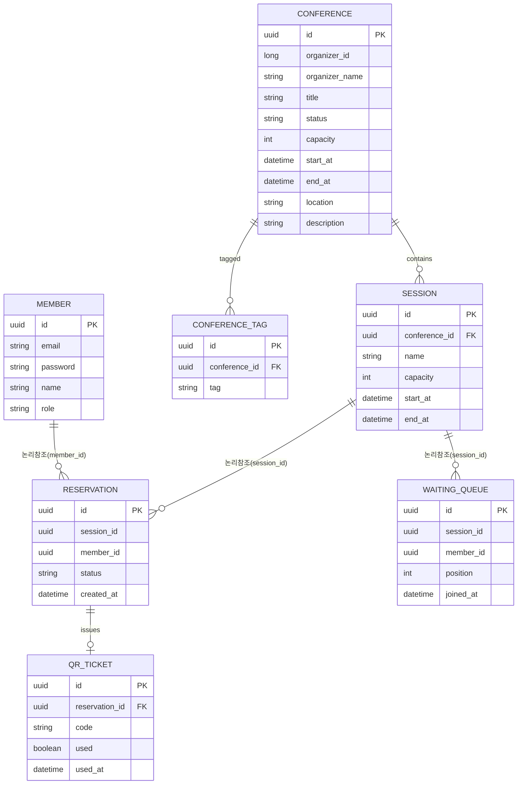

# ERD 정의서

> **작성·동기화 메타정보**
> 
> 
> Notion 원본 URL: `https://app.notion.com/p/3-3c973873401a8045ac7ee8adcaf2b71a`
> 
> Snapshot 기준 시점: `Sprint 1 Review 종료 시점 (2026-09-04)`
> 
> 동기화 시각: `2026-09-04 18:30 KST`
> 
> 직접 편집 금지: Git Snapshot은 직접 편집하지 않고 Notion 원본을 수정한 뒤 다시 동기화합니다.
> 

> 관련 업무 규칙: 정원 초과 금지, 대기열 순번 제한, 이메일 중복 금지, 세션정원 유효성, 결제 전 미확정, QR 1회성, 
데이터 소유권: 서비스경계
> 

## Service별 모델

| Service | Table·Aggregate | 핵심 Column | 불변식·상태 | 관련 Story·계약·Test | 상태 |
| --- | --- | --- | --- | --- | --- |
| Member-Service | member | `id, email(unique), 
 password,
name, role(참가자/주최자/전체관리자), created_at` | `email`unique, `role`은 가입시 확정 | Story 2, signUp/login | DONE |
| Member-Service | refresh_token | `id, member_id, token_hash(unique), expires_at, revoked, created_at` |  |  |  |
| Conference-Service | conference  | `id, organizer_id, organizer_name, title, status(신청/승인/반려), capacity, start_at, end_at, location, description` | `status`는 신청→승인/반려로만 전이, 역행 불가 | Story 5(9), 8(14) | PLANNED |
| Conference-Service | conference _tag | `id, conference_id, tag` | Software/AI/ML/Cloud/Security/Frontend/Backend/DevOps/Mobile/Data/Career/Startup |  |  |
| Conference-Service | session | `id, conference_id, name, capacity, 
apply_start_at, apply_end_at, session_start_at, session_end_at` | `capacity` > 0, `apply_start_at` < `apply_end_at`(신청 기간), `session_start_at` < `session_end_at`(세션 실제 진행 시각) | Story 9(3), 7(10) | PLANNED |
| Reservation-Service | reservation  | `id, session_id(논리참조), member_id(논리참조), headcount, status(HOLD`, `QUEUED`, `CONFIRMED`, `CANCELLED), created_at` | `status`는 홀드→확정 또는 홀드→취소, 홀드→대기(매진 시), 대기→확정으로만 전이, 확정된 예약들의 `headcount` 합 ≤ `session.capacity` | Story 9(3), 10(4) | PLANNED |
| Reservation-Service | waiting_queue | `id, reservation_id(FK), session_id(논리참조), member_id(논리참조), position, joined_at` | `position`은 `session_id` 내에서 unique, 순서대로 증가. `reservation_id`는 `reservation.status = 대기`인 건과 1:1 | Story 10(4) | DONE |
| Reservation-Service | qr_ticket | `id, reservation_id(FK), code(unique), used, used_at` | `code` unique, `used`는 1회만 `true`로 전이(역행 불가) | Story11(5), 13(7) | PLANNED |

## 관계 원칙

- Foreign Key는 같은 Service DB 안에서만 사용합니다.
    - 예: `qr_ticket.reservation_id`는 같은 Reservation-Service 안의 `reservation.id`라 FK 사용 가능
- 다른 Service ID는 논리 참조입니다.
    - 예: `reservation.session_id`는 Conference-Service 소유 데이터라 FK 아닌 논리 참조(그냥 숫자/UUID 값만 저장, DB 레벨 제약 없음)
- 생성 시점 값이 필요하면 Snapshot 목적과 갱신 금지를 명시합니다.
    - (현재 Sprint 범위에서는 해당 없음 — 추후 정산 시 매출 Snapshot 필요 시 추가)
- 상태 전이와 Unique·Transaction 근거를 업무 규칙과 실제 Test에 연결합니다.
    - `reservation.status` 전이 규칙 → 결제 전 미확정
    - `qr_ticket.code` unique + used 1회성 → QR 1회성

아직 구현하지 않은 Sprint의 Table·Index·복구 구조는 미정으로 둡니다.