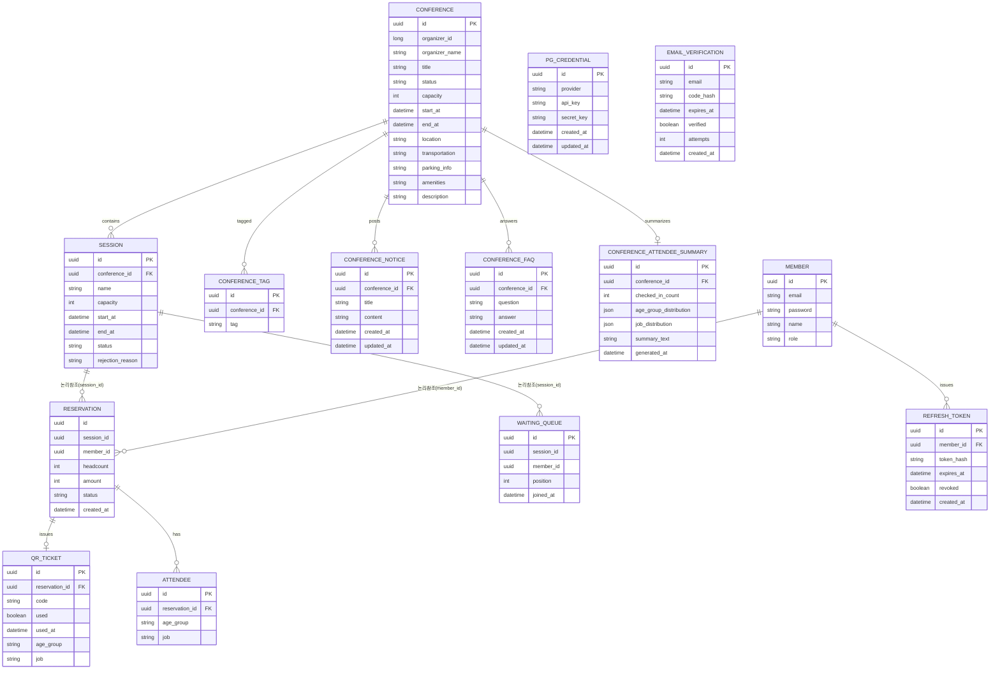

# ERD 정의서

> **작성·동기화 메타정보**
> 
> 
> Notion 원본 URL: `https://app.notion.com/p/3-3c973873401a8045ac7ee8adcaf2b71a`
> 
> Snapshot 기준 시점: `Sprint 2 Review 종료 시점 (2026-09-11)`
> 
> 동기화 시각: `2026-09-14 10:00 KST`
> 
> 직접 편집 금지: Git Snapshot은 직접 편집하지 않고 Notion 원본을 수정한 뒤 다시 동기화합니다.
> 

> 관련 업무 규칙: 정원 초과 금지, 대기열 순번 제한, 이메일 중복 금지, 세션정원 유효성, 결제 전 미확정, QR 1회성,
데이터 소유권: 서비스경계
> 

## Service별 모델

| Service | Table·Aggregate | 핵심 Column | 불변식·상태 | 관련 Story·계약·Test | 상태 |
| --- | --- | --- | --- | --- | --- |
| Member-Service | member | `id, email(unique), password, name, role(참가자/주최자/전체관리자), created_at` | `email`unique, `role`은 가입시 확정 | Story 2, signUp/login | DONE |
| Member-Service | refresh_token | `id, member_id, token_hash(unique), expires_at, revoked, created_at` |  |  | DONE |
| Member-Service | email_verification | `id, email, code_hash, expires_at, verified, attempts, created_at` | `verified`는 검증 성공 시에만 false→true로 전이(역행 없음), `attempts`는 `max_attempts`(5회) 도달 시 해당 레코드로는 더 이상 검증 불가(재발송 필요), 재발송 시 기존 레코드는 삭제 후 재발급 | Story 2, `POST /api/auth/email/send-code`·`POST /api/auth/email/verify`, EmailVerificationTest | DONE |
| Conference-Service | conference | `id, organizer_id, organizer_name, title, status(신청/승인/반려), capacity, start_at, end_at, location, transportation, parking_info, amenities, description` | `status`는 신청→승인/반려로만 전이, 역행 불가 / `location`은 `status`가 `승인`인 이후 값이 변경되는 요청은 거부(동일 값 재제출은 허용) / `transportation`·`parking_info`·`amenities`·`description`은 승인 여부와 무관하게 언제든 수정 가능 | Story 5 | PLANNED |
| Conference-Service | conference_tag | `id, conference_id, tag` | Software/AI/ML/Cloud/Security/Frontend/Backend/DevOps/Mobile/Data/Career/Startup |  | PLANNED |
| Conference-Service | conference_notice | `id, conference_id, title, content, created_at, updated_at` | 제목·내용은 언제든 수정 가능, 수정 시 `updated_at` 갱신 | Story 5 | PLANNED |
| Conference-Service | conference_faq | `id, conference_id, question, answer, created_at, updated_at` | 제목·내용은 언제든 수정 가능, 수정 시 `updated_at` 갱신 | Story 5 | PLANNED |
| Conference-Service | session | `id, conference_id, name, capacity, apply_start_at, apply_end_at, session_start_at, session_end_at` | `capacity` > 0, `apply_start_at` < `apply_end_at`(신청 기간), `session_start_at` < `session_end_at`(세션 실제 진행 시각) | Story 9(3), 7(10) | PLANNED |
| Conference-Service | conference_attendee_summary | `id, conference_id(unique), checked_in_count, age_group_distribution(JSON), job_distribution(JSON), summary_text, generated_at` | conference_id에 UNIQUE — 컨퍼런스당 1행만 유지, checked_in_count 변동 시에만 재계산(upsert) | Story 15 · getAttendeeSummary | PLANNED |
| Reservation-Service | reservation | `id, session_id(논리참조), member_id(논리참조), headcount, status(HOLD, QUEUED, CONFIRMED, CANCELLED), created_at,
amount` | `status`는 홀드→확정 또는 홀드→취소, 홀드→대기(매진 시), 대기→확정으로만 전이, 확정된 예약들의 `headcount` 합 ≤ `session.capacity` | Story 9(3), 10(4) | PLANNED |
| Reservation-Service | waiting_queue | `id, reservation_id(FK), session_id(논리참조), member_id(논리참조), position, joined_at` | `position`은 `session_id` 내에서 unique, 순서대로 증가. `reservation_id`는 `reservation.status = 대기`인 건과 1:1 | Story 10(4) | DONE |
| Reservation-Service | qr_ticket | `id, reservation_id(FK), code(unique), used, used_at, age_group, job` | `code` unique, `used`는 1회만 `true`로 전이(역행 불가), `age_group`, `job`은 결제 확정 시 `attendee` 데이터로부터 복사되어 채워짐 | Story11(5), 13(7) | PLANNED |
| Reservation-Service | attendee  | `id`, `reservation_id`, `age_group`, `job` | `reservation_id`당 `headcount` 개수만큼 생성, 신청(HOLD) 시점에 함께 저장 | Story 15 | PLANNED |
| Reservation-Service | pg_credential | id, provider, api_key, secret_key(암호화 저장), created_at, updated_at | Secret 값은 문서·커밋에 기록하지 않는다([pg키-비공개]) / 등록 시 기존 레코드 update-or-create(provider 단위로 1건 유지) | Story 19 | PLANNED |

## 관계 원칙

- Foreign Key는 같은 Service DB 안에서만 사용합니다.
    - 예: `qr_ticket.reservation_id`는 같은 Reservation-Service 안의 `reservation.id`라 FK 사용 가능
- 다른 Service ID는 논리 참조입니다.
    - 예: `reservation.session_id`는 Conference-Service 소유 데이터라 FK 아닌 논리 참조(그냥 숫자/UUID 값만 저장, DB 레벨 제약 없음)
- 생성 시점 값이 필요하면 Snapshot 목적과 갱신 금지를 명시합니다.
    - (현재 Sprint 범위에서는 해당 없음 — 추후 정산 시 매출 Snapshot 필요 시 추가)
- 상태 전이와 Unique·Transaction 근거를 업무 규칙과 실제 Test에 연결합니다.
    - `reservation.status` 전이 규칙 → 결제 전 미확정
    - `qr_ticket.code` unique + used 1회성 → QR 1회성

```mermaid
erDiagram
    CONFERENCE ||--o{ SESSION : contains
    CONFERENCE ||--o{ CONFERENCE_TAG : tagged
    CONFERENCE ||--o{ CONFERENCE_NOTICE : posts
    CONFERENCE ||--o{ CONFERENCE_FAQ : answers
    CONFERENCE ||--o| CONFERENCE_ATTENDEE_SUMMARY : summarizes
    SESSION ||--o{ RESERVATION : "논리참조(session_id)"
    SESSION ||--o{ WAITING_QUEUE : "논리참조(session_id)"
    RESERVATION ||--o| QR_TICKET : issues
    MEMBER ||--o{ RESERVATION : "논리참조(member_id)"
## 관계 원칙

- Foreign Key는 같은 Service DB 안에서만 사용합니다.
    - 예: `qr_ticket.reservation_id`는 같은 Reservation-Service 안의 `reservation.id`라 FK 사용 가능
- 다른 Service ID는 논리 참조입니다.
    - 예: `reservation.session_id`는 Conference-Service 소유 데이터라 FK 아닌 논리 참조(그냥 숫자/UUID 값만 저장, DB 레벨 제약 없음)
- 생성 시점 값이 필요하면 Snapshot 목적과 갱신 금지를 명시합니다.
    - (현재 Sprint 범위에서는 해당 없음 — 추후 정산 시 매출 Snapshot 필요 시 추가)
- 상태 전이와 Unique·Transaction 근거를 업무 규칙과 실제 Test에 연결합니다.
    - `reservation.status` 전이 규칙 → 결제 전 미확정
    - `qr_ticket.code` unique + used 1회성 → QR 1회성
```



아직 구현하지 않은 Sprint의 Table·Index·복구 구조는 미정으로 둡니다.