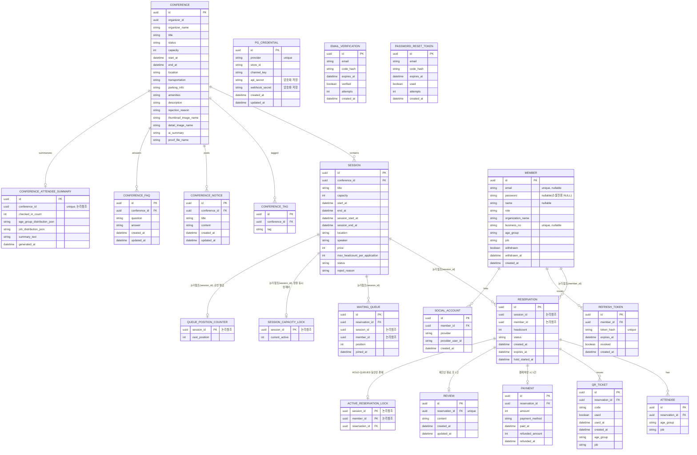

# ERD 정의서

> **작성·동기화 메타정보**
> 
> 
> Notion 원본 URL: `https://app.notion.com/p/3-3c973873401a8045ac7ee8adcaf2b71a`
> 
> Snapshot 기준 시점: `Sprint 4 Review 종료 시점 (2026-09-28)`
> 
> 동기화 시각: `2026-09-29 11:00 KST`
> 
> 직접 편집 금지: Git Snapshot은 직접 편집하지 않고 Notion 원본을 수정한 뒤 다시 동기화합니다.
> 

> 관련 업무 규칙: 정원 초과 금지, 대기열 순번 제한, 이메일 중복 금지, 세션정원 유효성, 결제 전 미확정, QR 1회성, 취소환불 기한, 후기 작성자격, 후기 1회성, 탈퇴-즉시익명화, 소셜계정-수동연동, pg키-비공개
데이터 소유권: 서비스경계
> 

## Service별 모델

| Service | Table·Aggregate | 핵심 Column | 불변식·상태 | 관련 Story·계약·Test | 상태 |
| --- | --- | --- | --- | --- | --- |
| Member-Service | member | `id, email(unique, nullable), password(nullable), name(nullable), role(MEMBER/ORGANIZER/ADMIN), organization_name(nullable), business_no(unique, nullable), age_group, job, withdrawn, withdrawn_at, created_at` | `email`·`business_no` unique(둘 다 nullable — 탈퇴 시 NULL로 비워 재가입 허용), `role`은 가입 시 확정(관리자 권한변경 API 제외), `password`가 NULL이면 소셜 전용 계정, 탈퇴 시 `withdrawn=true`+PII(`email`/`password`/`name`) NULL 처리(row는 삭제하지 않음 — 결제·정산 참조 무결성 유지) | Story 2·3·22·24, signup/login/withdraw | DONE |
| Member-Service | social_account | `id, member_id(FK), provider(GOOGLE/KAKAO), provider_user_id, created_at` | `(provider, provider_user_id)` unique — 동일 소셜 계정은 한 member에만 연결. 최초 소셜 로그인 시 자동 생성되는 계정은 항상 `role=MEMBER`(주최자·관리자 발급 불가). 이메일이 같아도 자동 연동되지 않고 별도 연동(link) API로만 매핑 | Story 22, `POST /api/auth/social/{provider}`·`POST /api/auth/social/{provider}/link` | DONE |
| Member-Service | refresh_token | `id, member_id, token_hash(unique), expires_at, revoked, created_at` | 평문 토큰은 저장하지 않음(SHA-256 해시만), rotate 시 기존 행은 `revoked=true`로 전이(역행 없음), 이미 폐기된 토큰 재사용 시 해당 회원의 모든 행이 일괄 폐기됨 | Story 2 Task 2-1, `POST /api/auth/refresh` | DONE |
| Member-Service | email_verification | `id, email, code_hash, expires_at, verified, attempts, created_at` | `verified`는 검증 성공 시에만 false→true로 전이(역행 없음), `attempts`는 `max_attempts`(5회) 도달 시 해당 레코드로는 더 이상 검증 불가(재발송 필요), 재발송 시 기존 레코드는 삭제 후 재발급, 재전송은 최초 발급 후 1분 경과해야 가능 | Story 2, `POST /api/auth/email/send-code`·`POST /api/auth/email/verify` | DONE |
| Member-Service | password_reset_token | `id, email, code_hash, expires_at, used, attempts, created_at` | `email_verification`과 동일한 코드 발급·시도횟수 규칙(유효 10분, 재전송 쿨다운 1분, 5회 실패 시 재발급 필요), `used`는 재설정 성공 시에만 false→true, 소셜 전용 계정(`member.password` NULL)은 발급 자체가 거부됨 | Story 23, `POST /api/auth/password/reset-request`·`reset-confirm` | DONE |
| Conference-Service | conference | `id, organizer_id, organizer_name(승인 시점 스냅샷), title, status(PENDING/APPROVED/REJECTED), capacity, start_at, end_at, location, transportation, parking_info, amenities, description, rejection_reason, thumbnail_image_name, detail_image_name, ai_summary, proof_file_name` | `status`는 `PENDING`→`APPROVED`/`REJECTED`로만 전이, 역행 불가(재요청 시 `409`) / `location`은 `status=APPROVED` 이후 값이 실제로 바뀌는 요청만 거부(동일 값 재제출은 허용) / `transportation`·`parking_info`·`amenities`·`description`·`ai_summary`는 승인 여부와 무관하게 언제든 수정 가능 / 소개글 삽입 이미지는 1장 초과 금지 / `ai_summary`는 등록·소개글 수정 시점에 Gemini API로 자동 생성, 생성 실패해도 저장 자체는 성공(빈 값 유지) | Story 5·26 | DONE |
| Conference-Service | conference_tag | `id, conference_id, tag` | 자유 문자열(고정 Enum 아님), 등록 시 대소문자 무시 중복 제거, 최소 1개 필수 | Story 5 | DONE |
| Conference-Service | conference_notice | `id, conference_id, title, content, created_at, updated_at` | 제목·내용은 언제든 수정 가능, 수정 시 `updated_at` 갱신 | Story 5 | DONE |
| Conference-Service | conference_faq | `id, conference_id, question, answer, created_at, updated_at` | 제목·내용은 언제든 수정 가능, 수정 시 `updated_at` 갱신 | Story 5 | DONE |
| Conference-Service | session | `id, conference_id, title, capacity, start_at, end_at(신청 기간), session_start_at, session_end_at(진행 일정), location, speaker, price, max_headcount_per_application, status(PENDING/APPROVED/REJECTED), reject_reason` | `capacity` > 0, `end_at` > `start_at`, `session_end_at` > `session_start_at`, `session_start_at` ≥ `end_at`(신청 종료 이후 진행), `max_headcount_per_application` ≤ `capacity`, 세션 `capacity` ≤ 컨퍼런스 `capacity`. 승인·반려된 세션의 정원·일정을 실제로 변경하면 `status`가 `PENDING`으로 재전이(재승인 필요). 확정 예약이 있는 세션은 정원을 확정 인원 미만으로 낮추거나 일정을 바꿀 수 없음(`409`) | Story 7·8 | DONE |
| Conference-Service | conference_attendee_summary | `id, conference_id(unique, 논리참조), checked_in_count, age_group_distribution_json, job_distribution_json, summary_text, generated_at` | `conference_id`에 UNIQUE — 컨퍼런스당 1행만 유지, `checked_in_count` 변동 시에만 재계산(upsert), 0명이면 LLM 미호출·고정 안내 문구 | Story 15 · getAttendeeSummary | DONE |
| Reservation-Service | reservation | `id, session_id(논리참조), member_id(논리참조), headcount, status(HOLD/QUEUED/CONFIRMED/CANCELLED), created_at, expires_at, hold_started_at` | `status`는 홀드→확정, 홀드→취소, 홀드→대기(정원 소진 시), 대기→확정(승격 시 대기→홀드를 거치지 않고 결제 API 내에서 직접 확정), 확정→취소로만 전이 / 확정된 예약들의 `headcount` 합은 `session_capacity_lock.current_active`로 별도 관리되어 `session.capacity`를 초과하지 않음 / `headcount`는 인원 개별 취소 시 1씩 감소(가변) / `expires_at`은 홀드 생성·재승격 시 현재시각+10분으로 갱신, 만료 시 스케줄러가 자동 취소 | Story 9·10·11·12 | DONE |
| Reservation-Service | attendee | `id, reservation_id, age_group, job` | `reservation_id`당 `headcount` 개수만큼 생성, 신청(HOLD/QUEUED) 시점에 함께 저장, 생성 후 불변(수정·삭제 없음 — 인원 개별 취소로도 삭제되지 않음). 9명 이하 개별 입력 시 화면이 본인 좌석(1번)만 로그인 회원의 마이페이지 프로필(연령대·직무)로 자동 채워주며, 이미 선택한 값은 덮어쓰지 않음(화면 전용 편의 기능, API 계약 자체는 변경 없음) | Story 9·15 | DONE |
| Reservation-Service | waiting_queue | `id, reservation_id(FK), session_id(논리참조), member_id(논리참조), position, joined_at` | `(session_id, position)` unique, `queue_position_counter`로 원자적 증가 발급. `reservation_id`는 `reservation.status = QUEUED`인 건과 1:1, 승격·취소 시 뒷사람 순번이 즉시 당겨짐 | Story 10 | DONE |
| Reservation-Service | session_capacity_lock | `session_id(PK, 논리참조), current_active` | 조건부 `UPDATE ... WHERE current_active + n <= capacity`로 증가(선점), 조건 불만족 시 0행 갱신(정원 초과 판정) — read-then-write 경쟁 없이 동시성 제어 | Story 9·10, 정원-초과-금지 | DONE |
| Reservation-Service | queue_position_counter | `session_id(PK, 논리참조), next_position` | 원자적 카운터(세션당 1행) — 신규 등록 시 `+1` 하여 순번 발급. **누군가 대기열에서 빠질 때(취소·승격·정리)마다 뒷사람 순번 당김과 함께 이 카운터도 `-1`**(2026-09-28 버그 수정 — 이전에는 카운터를 그대로 둬서 재등록 시 순번이 밀리는 문제가 있었음). 감소 쪽 트랜잭션이 먼저 행을 잠가 동시 등록과의 순번 겹침을 방지 | Story 10 | DONE |
| Reservation-Service | active_reservation_lock | `session_id(PK1, 논리참조), member_id(PK2, 논리참조), reservation_id(FK)` | 복합 PK로 "회원 1명당 세션 1개에 활성(HOLD/QUEUED) 예약 1건" 제약을 DB 레벨에서 강제, 결제 확정·취소 시 행 삭제 | Story 9, 중복-신청-금지 | DONE |
| Reservation-Service | qr_ticket | `id, reservation_id(FK), code(unique), used, used_at, created_at, age_group, job` | `code` unique(발급 시 UUID 기반), `used`는 1회만 `true`로 전이(역행 불가), `age_group`·`job`은 결제 확정 시 `attendee` 데이터로부터 스냅샷 복사, 세션 시작 전 스캔은 거부, 인원 개별 취소 시 해당 행 삭제 | Story 11·13, Task 12-5 | DONE |
| Reservation-Service | payment | `id, reservation_id, amount, payment_method, paid_at, refunded_amount, refunded_at` | `amount`는 결제 확정 시점의 `price × headcount`(무료 세션은 0, `payment_method="FREE"`), `refunded_amount`는 전체·부분 환불 시 누적(덮어쓰지 않음 — 인원 개별 취소가 여러 번 있어도 합산), 결제 상태는 별도 Enum 없이 `reservation.status`(CONFIRMED/CANCELLED)와 `refunded_amount` 유무로 판단 | Story 11·12, PortOne 연동 | DONE |
| Reservation-Service | review | `id, reservation_id(unique), content, created_at, updated_at` | `reservation_id` unique — 예약 1건당 후기 1개(같은 예약으로 재작성 시 update-or-insert), 체크인(QR 사용) 완료 좌석이 1개 이상 있어야 작성 가능. `member_id`는 저장하지 않아 조회 응답에 작성자 정보가 노출될 방법 자체가 없음([후기-익명]) | Story 20, 후기-작성자격·후기-1회성 | DONE |
| Reservation-Service | pg_credential | `id, provider(unique), store_id, channel_key, api_secret(AES-GCM 암호화), webhook_secret(AES-GCM 암호화), created_at, updated_at` | Secret 값은 문서·커밋에 평문 기록하지 않는다([pg키-비공개]) / 등록 시 기존 레코드 update-or-create(provider 단위로 1건 유지) / 조회 응답에서는 뒤 4자리만 노출하고 나머지는 마스킹 | Story 19 | DONE |

## 관계 원칙

- Foreign Key는 같은 Service DB 안에서만 사용합니다.
    - 예: `qr_ticket.reservation_id`는 같은 Reservation-Service 안의 `reservation.id`라 FK 사용 가능
- 다른 Service ID는 논리 참조입니다.
    - 예: `reservation.session_id`는 Conference-Service 소유 데이터라 FK 아닌 논리 참조(그냥 숫자/UUID 값만 저장, DB 레벨 제약 없음)
- 생성 시점 값이 필요하면 Snapshot 목적과 갱신 금지를 명시합니다.
    - `conference.organizer_name`은 컨퍼런스 등록 시점 주최기관명 스냅샷(JWT `organizationName` Claim 고정) — 이후 회원 정보가 바뀌어도 갱신하지 않음
    - `qr_ticket.age_group`/`job`은 결제 확정 시점의 `attendee` 값 스냅샷 — 이후 `attendee`가 바뀌어도(현재는 불변이지만) 갱신하지 않음
- 상태 전이와 Unique·Transaction 근거를 업무 규칙과 실제 Test에 연결합니다.
    - `reservation.status` 전이 규칙 → 결제 전 미확정
    - `qr_ticket.code` unique + `used` 1회성 → QR 1회성
    - `session_capacity_lock`의 조건부 UPDATE → 정원-초과-금지
    - `active_reservation_lock`의 복합 PK → 중복-신청-금지
    - `queue_position_counter`의 증가·감소 대칭 처리 → 대기열 순번이 밀리거나 겹치지 않음을 보장(2026-09-28 수정)
    - `member.email`/`business_no` unique(둘 다 nullable) → 이메일-중복-금지·주최자가입-중복금지, 탈퇴 시 NULL 처리로 즉시 재가입 허용
    - `social_account`의 `(provider, provider_user_id)` unique → 소셜계정-수동연동(이메일 일치만으로는 자동 매핑하지 않음)

```mermaid
erDiagram
    CONFERENCE ||--o{ SESSION : contains
    CONFERENCE ||--o{ CONFERENCE_TAG : tagged
    CONFERENCE ||--o{ CONFERENCE_NOTICE : posts
    CONFERENCE ||--o{ CONFERENCE_FAQ : answers
    CONFERENCE ||--o| CONFERENCE_ATTENDEE_SUMMARY : summarizes
    SESSION ||--o{ RESERVATION : "논리참조(session_id)"
    SESSION ||--o{ WAITING_QUEUE : "논리참조(session_id)"
    SESSION ||--o| SESSION_CAPACITY_LOCK : "논리참조(session_id), 정원 동시성 제어"
    SESSION ||--o| QUEUE_POSITION_COUNTER : "논리참조(session_id), 순번 발급"
    RESERVATION ||--o{ ATTENDEE : has
    RESERVATION ||--o{ QR_TICKET : issues
    RESERVATION ||--o| PAYMENT : "결제 확정 시 1건"
    RESERVATION ||--o| REVIEW : "체크인 완료 후 1건"
    RESERVATION ||--o| ACTIVE_RESERVATION_LOCK : "HOLD·QUEUED 동안만 존재"
    MEMBER ||--o{ RESERVATION : "논리참조(member_id)"
    MEMBER ||--o{ REFRESH_TOKEN : issues
    MEMBER ||--o{ SOCIAL_ACCOUNT : links

    CONFERENCE {
        uuid id PK
        uuid organizer_id
        string organizer_name
        string title
        string status
        int capacity
        datetime start_at
        datetime end_at
        string location
        string transportation
        string parking_info
        string amenities
        string description
        string rejection_reason
        string thumbnail_image_name
        string detail_image_name
        string ai_summary
        string proof_file_name
    }
    CONFERENCE_TAG {
        uuid id PK
        uuid conference_id FK
        string tag
    }
    CONFERENCE_NOTICE {
        uuid id PK
        uuid conference_id FK
        string title
        string content
        datetime created_at
        datetime updated_at
    }
    CONFERENCE_FAQ {
        uuid id PK
        uuid conference_id FK
        string question
        string answer
        datetime created_at
        datetime updated_at
    }
    CONFERENCE_ATTENDEE_SUMMARY {
        uuid id PK
        uuid conference_id "unique, 논리참조"
        int checked_in_count
        string age_group_distribution_json
        string job_distribution_json
        string summary_text
        datetime generated_at
    }
    SESSION {
        uuid id PK
        uuid conference_id FK
        string title
        int capacity
        datetime start_at
        datetime end_at
        datetime session_start_at
        datetime session_end_at
        string location
        string speaker
        int price
        int max_headcount_per_application
        string status
        string reject_reason
    }
    RESERVATION {
        uuid id PK
        uuid session_id "논리참조"
        uuid member_id "논리참조"
        int headcount
        string status
        datetime created_at
        datetime expires_at
        datetime hold_started_at
    }
    ATTENDEE {
        uuid id PK
        uuid reservation_id FK
        string age_group
        string job
    }
    WAITING_QUEUE {
        uuid id PK
        uuid reservation_id FK
        uuid session_id "논리참조"
        uuid member_id "논리참조"
        int position
        datetime joined_at
    }
    SESSION_CAPACITY_LOCK {
        uuid session_id PK "논리참조"
        int current_active
    }
    QUEUE_POSITION_COUNTER {
        uuid session_id PK "논리참조"
        int next_position
    }
    ACTIVE_RESERVATION_LOCK {
        uuid session_id PK "논리참조"
        uuid member_id PK "논리참조"
        uuid reservation_id FK
    }
    QR_TICKET {
        uuid id PK
        uuid reservation_id FK
        string code
        boolean used
        datetime used_at
        datetime created_at
        string age_group
        string job
    }
    PAYMENT {
        uuid id PK
        uuid reservation_id FK
        int amount
        string payment_method
        datetime paid_at
        int refunded_amount
        datetime refunded_at
    }
    REVIEW {
        uuid id PK
        uuid reservation_id FK "unique"
        string content
        datetime created_at
        datetime updated_at
    }
    PG_CREDENTIAL {
        uuid id PK
        string provider "unique"
        string store_id
        string channel_key
        string api_secret "암호화 저장"
        string webhook_secret "암호화 저장"
        datetime created_at
        datetime updated_at
    }
    MEMBER {
        uuid id PK
        string email "unique, nullable"
        string password "nullable(소셜전용 NULL)"
        string name "nullable"
        string role
        string organization_name
        string business_no "unique, nullable"
        string age_group
        string job
        boolean withdrawn
        datetime withdrawn_at
        datetime created_at
    }
    REFRESH_TOKEN {
        uuid id PK
        uuid member_id FK
        string token_hash "unique"
        datetime expires_at
        boolean revoked
        datetime created_at
    }
    SOCIAL_ACCOUNT {
        uuid id PK
        uuid member_id FK
        string provider
        string provider_user_id
        datetime created_at
    }
    EMAIL_VERIFICATION {
        uuid id PK
        string email
        string code_hash
        datetime expires_at
        boolean verified
        int attempts
        datetime created_at
    }
    PASSWORD_RESET_TOKEN {
        uuid id PK
        string email
        string code_hash
        datetime expires_at
        boolean used
        int attempts
        datetime created_at
    }
```

## Sprint 3 이후 확정된 주요 변경 사항 (v1.0 요구사항 반영)

- `member.email`/`business_no`가 `NOT NULL unique`에서 `nullable unique`로 변경됨 — 탈퇴 시 PII를 NULL로 비우고 row는 보존하는 방식([탈퇴-즉시익명화])으로 결정했기 때문. 완전 삭제(hard delete) 대신 이 방식을 택한 이유는 `payment`·`reservation`의 `member_id` 논리 참조 무결성을 깨지 않기 위함.
- `social_account` 테이블 신규 추가 — Story 22(소셜 로그인) 반영. `provider` 컬럼은 코드상 `@Enumerated` STRING 지정 없이 ORDINAL로 저장되고 있어(다른 모든 Enum 컬럼과 다른 패턴), Enum 선언 순서가 바뀌면 기존 데이터가 깨지는 위험이 있음 — 후속 리팩터링 필요 항목으로 기록.
- `password_reset_token` 테이블 신규 추가 — Story 23 반영, `email_verification`과 동일한 코드 검증 패턴 재사용.
- `session`에 `session_start_at`/`session_end_at`(진행 일정, 신청 기간과 별도), `speaker`, `price`, `max_headcount_per_application`, `reject_reason` 컬럼 추가 — 최초 ERD 초안의 `start_at`/`end_at`은 "신청 기간"만 표현했으나, 실제 구현은 "신청 기간"과 "세션 실제 진행 시각"을 분리해 컨퍼런스 기간 내 세션 진행 일정 검증([세션정원-유효성] 확장)에 사용.
- `qr_ticket` 발급 단위가 `attendee`와 1:1이지만 **FK로 연결되지 않음** — 인원 개별 취소(Task 12-5) 시 사람 단위 식별자는 `attendee.id`가 아니라 `qr_ticket.id`를 기준으로 삼기로 결정(설계 메모, Task 12-5 Issue).
- `payment` 테이블 신규 추가 — 결제 확정 금액·환불 누적액을 별도 관리. `refunded_amount`는 최초 ERD 설계에는 없던 "누적" 개념으로, 인원 개별 취소가 여러 번 발생해도 이전 환불 기록을 덮어쓰지 않도록 Task 12-5에서 버그 수정.
- `review` 테이블 신규 추가 — Story 20 반영.
- `session_capacity_lock`·`queue_position_counter`·`active_reservation_lock`은 최초 ERD 설계 시점에는 별도 테이블로 명시되지 않았던 동시성 제어 전용 테이블 — `reservation`/`waiting_queue`의 상태 컬럼만으로는 read-then-write 경쟁을 막을 수 없어 Sprint 1~3에 걸쳐 추가됨.
- **`queue_position_counter`가 지금까지는 "증가만" 하는 카운터로 기록돼 있었으나, 2026-09-28 수정으로 "대기열 이탈(취소·승격·정리) 시 감소"도 함께 수행하도록 확정됨.** 감소를 빼먹으면 앞사람이 빠진 뒤 새로 등록한 사람이 실제 앞 순번이 없는데도 그 다음 번호를 받는 버그가 있었음(`PaymentQrAcceptanceTest`로 재현·검증).
- `pg_credential`의 컬럼명이 초안의 `api_key`/`secret_key`에서 실제 구현은 `store_id`/`channel_key`/`api_secret`/`webhook_secret`으로 확정됨(PortOne 결제위젯 연동 방식에 맞춤).
