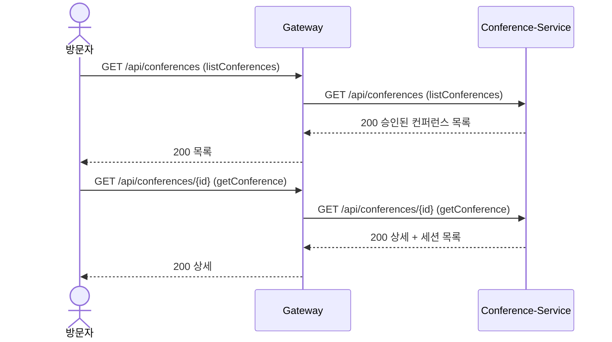
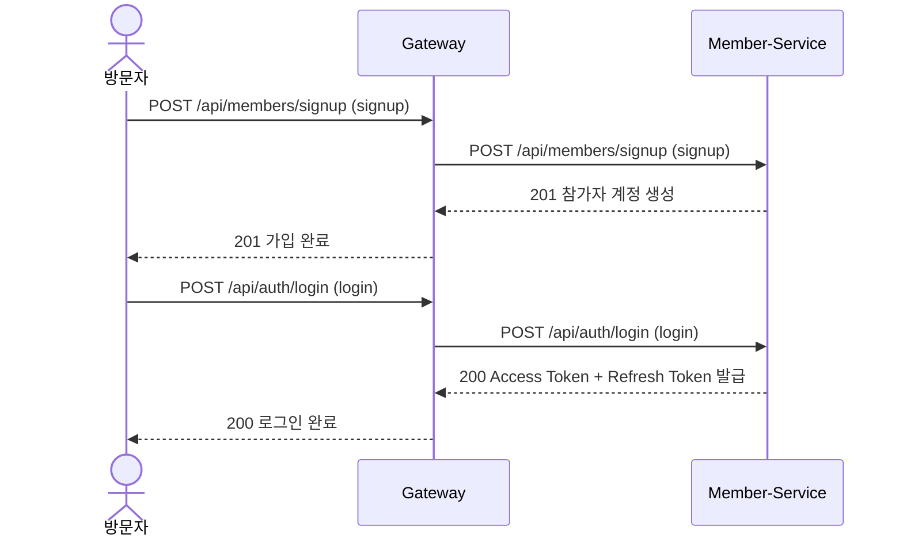
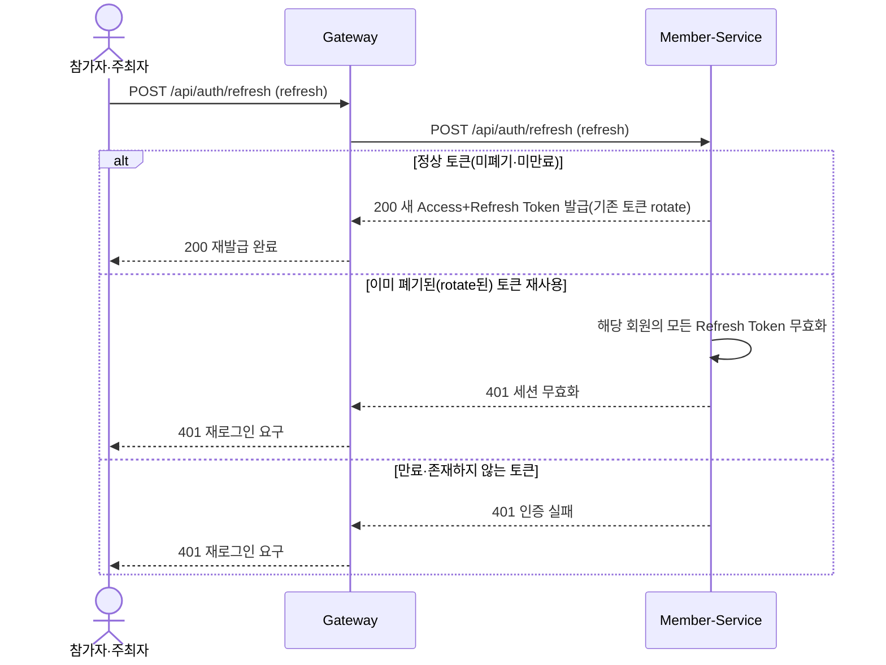
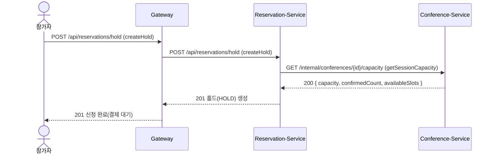
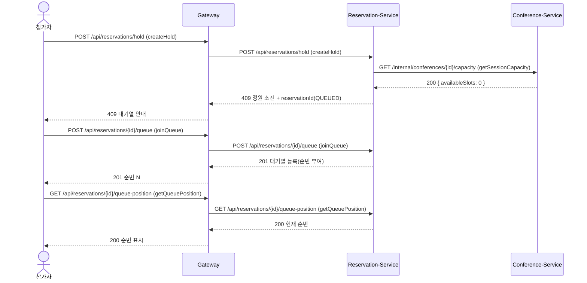
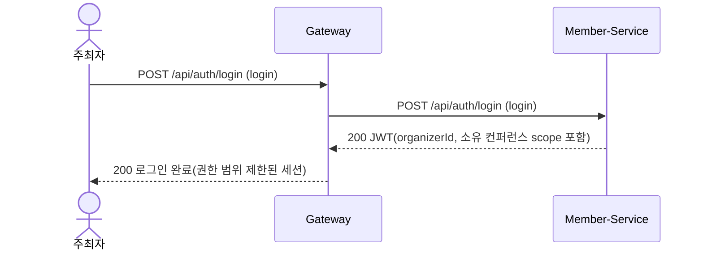
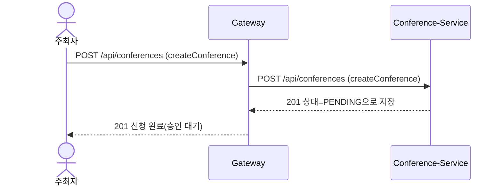
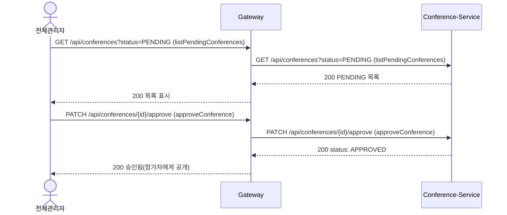

# 시퀀스

> **작성·동기화 메타정보**
> 
> 
> Notion 원본 URL: `https://app.notion.com/p/3cd73873401a8002a389e5ee51bebf20`
> 
> Snapshot 기준 시점: `Sprint 1 Review 종료 시점 (2026-09-04)`
> 
> 동기화 시각: `2026-09-04 18:30 KST`
> 
> 직접 편집 금지: Git Snapshot은 직접 편집하지 않고 Notion 원본을 수정한 뒤 다시 동기화합니다.
> 

> 계약: [API 문서·OpenAPI 링크]
관련 Story·Sprint 검증: [GitHub Issue·테스트 전략 링크]
> 

## 정상 흐름

### **Story 1 — 방문자가 컨퍼런스·세션을 검색한다 (`#1`)**

### **Story 2 — 방문자가 회원가입한다 (`#3`)**

### **Story 2 부속 — Refresh Token으로 Access Token을 재발급한다 (Task 2-1 `#9`)**

### **Story 3 — 참가자가 세션을 신청한다 (`#20`)**

### **Story 4 — 정원 임박 세션에 동시 신청이 몰릴 때 대기열로 처리한다 (`#6`)**

### **Story 8 — 주최자가 발급받은 계정으로 로그인해 권한 범위를 확인한다 (`#28`)**

### **Story 9 — 주최자가 컨퍼런스를 등록 신청한다 (`#35`)**

### **Story 13 — 전체관리자가 주최자 계정을 생성한다 (`#26`)**

### **Story 14 — 전체관리자가 신청된 컨퍼런스를 검토해 승인·반려한다 (`#27`)**

## 실패·복구 흐름

| 시작 조건 | 관련 업무 규칙·계약 | 실패 지점 | 안전한 결과 | 재시도·복구 | 관련 Test·Sprint Demo |
| --- | --- | --- | --- | --- | --- |
| 미승인·존재하지 않는 컨퍼런스 상세 조회 | [승인-전-비공개] / `getConference` | Conference-Service 조회 결과 없음 | `404`(존재 여부 노출 안 함) | 목록으로 복귀 안내 | `ConferenceVisibilityTest` (Task 1-3 `#5`) |
| 이미 가입된 이메일로 회원가입 시도 | [이메일-중복-금지] / `signup` | Member-Service Unique 제약 위반 | `409`, 계정 미생성 | 다른 이메일 재입력 또는 로그인 유도 | `MemberSignupLoginTest` (Task 2-2 `#25`) |
| 세션 정원 조회(`getSessionCapacity`) Timeout·오류 | [정원-초과-금지] / `createHold` | Reservation→Conference 내부 호출 실패 | `503`, 홀드 생성 안 함(Fail-closed) | 클라이언트 재시도 안내 | `CapacityContractFailureTest` (Task 3-2 `#23`) |
| 대기열 순번 미도달 상태에서 결제 진입 시도 | [대기열-순번-제한] / `getQueuePosition` | 결제 진입 게이트(Sprint 2 결제 API 연계) | 결제 API 호출 자체가 거부됨 | 순번 도달까지 폴링 대기 | `WaitingQueueTest` (Task 4-1 `#7`) |
| 주최자가 소유하지 않은 컨퍼런스 자원에 접근 | [소유자원-접근제한] / 전체 `ORGANIZER` API | Cross-cutting 공통 인가 필터 | `403` | 본인 소유 자원으로 재요청 | `OwnerScopeGuardTest` (Task 8-2 `#32`) |
| 필수값 누락 상태로 컨퍼런스 등록 신청 | `createConference` | Conference-Service 입력 검증 | `400`, 저장 안 함 | 필수값 채워 재요청 | `ConferenceApplicationTest` (Task 9-2 `#37`) |
| 전체관리자 권한 없이 계정 생성 API 호출 | [관리자계정-승인필수] / `createOrganizerAccount` | Gateway 권한 검증(Member-Service 요청 전 차단) | `403` | 전체관리자 계정으로 재시도 | `OrganizerAccountRequestTest` (Task 13-1 `#29`) |
| 전체관리자 권한 없이 승인·반려 API 호출 | [승인-전-비공개] / `approveConference`·`rejectConference` | Gateway 권한 검증(Conference-Service 요청 전 차단) | `403`, 상태 변경 안 함(승인 전 상태 유지, Fail-closed) | 전체관리자 계정으로 재시도 | Task 14-3 Acceptance Test (`#40`) |
| 이미 폐기(rotate)된 Refresh Token이 다시 제출됨 | refresh (업무 규칙 아님 — 기술 결정) | Member-Service Refresh Token 조회 | `401`, 해당 회원의 모든 Refresh Token 무효화(재사용 탐지) | 재로그인 요구 | MemberSignupLoginTest (Task 2-1 `#9`) |

시퀀스에서 Payload를 다시 정의하지 않습니다. 호출 순서에는 실제 `operationId`, method/path, Event 이름을 사용합니다.