# 시퀀스

> **작성·동기화 메타정보**
> 
> 
> Notion 원본 URL: `https://app.notion.com/p/3cd73873401a8002a389e5ee51bebf20`
> 
> Snapshot 기준 시점: `Sprint 2 Review 종료 시점 (2026-09-11)`
> 
> 동기화 시각: `2026-09-14 10:00 KST`
> 
> 직접 편집 금지: Git Snapshot은 직접 편집하지 않고 Notion 원본을 수정한 뒤 다시 동기화합니다.
> 

> 계약: [API 문서·OpenAPI 링크]
관련 Story·Sprint 검증: [GitHub Issue·테스트 전략 링크]
> 

## 정상 흐름

### **Story 1 — 방문자가 컨퍼런스·세션을 검색한다 (`#1`)**

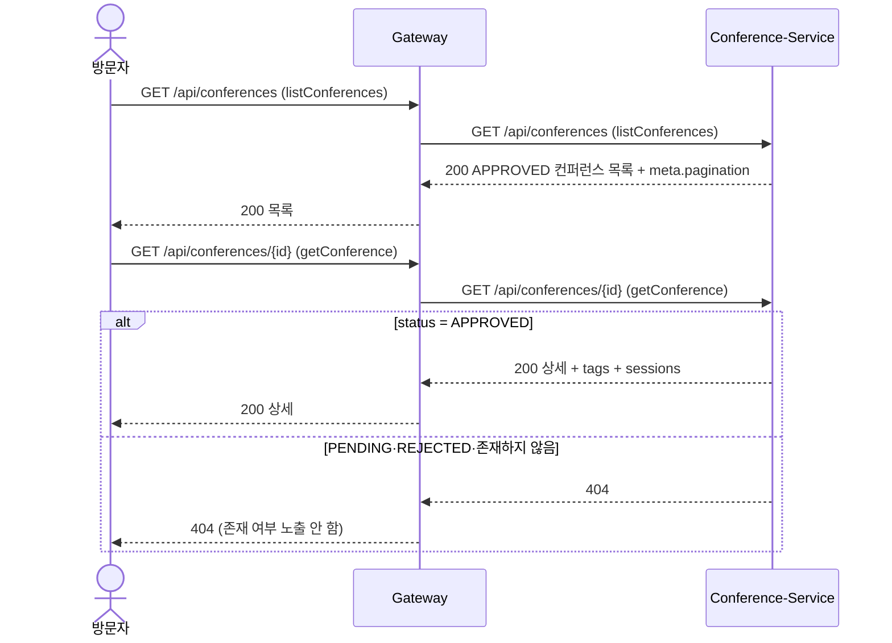
```mermaid
sequenceDiagram
    actor V as 방문자
    participant G as Gateway
    participant CS as Conference-Service
    V->>G: GET /api/conferences (listConferences)
    G->>CS: GET /api/conferences (listConferences)
    CS-->>G: 200 APPROVED 컨퍼런스 목록 + meta.pagination
    G-->>V: 200 목록
    V->>G: GET /api/conferences/{id} (getConference)
    G->>CS: GET /api/conferences/{id} (getConference)
    alt status = APPROVED
        CS-->>G: 200 상세 + tags + sessions
        G-->>V: 200 상세
    else PENDING·REJECTED·존재하지 않음
        CS-->>G: 404
        G-->>V: 404 (존재 여부 노출 안 함)
    end
```

### **Story 2 — 방문자가 회원가입한다 (`#3`)**

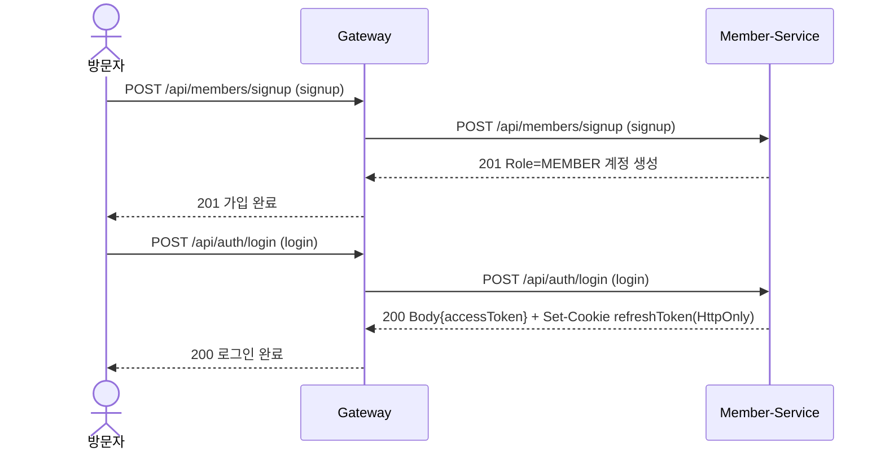
```mermaid
sequenceDiagram
    actor V as 방문자
    participant G as Gateway
    participant MS as Member-Service
    V->>G: POST /api/members/signup (signup)
    G->>MS: POST /api/members/signup (signup)
    MS-->>G: 201 Role=MEMBER 계정 생성
    G-->>V: 201 가입 완료
    V->>G: POST /api/auth/login (login)
    G->>MS: POST /api/auth/login (login)
    MS-->>G: 200 Body{accessToken} + Set-Cookie refreshToken(HttpOnly)
    G-->>V: 200 로그인 완료
```

### **Story 2 부속 — Refresh Token으로 Access Token을 재발급한다 (Task 2-1 `#9`)**

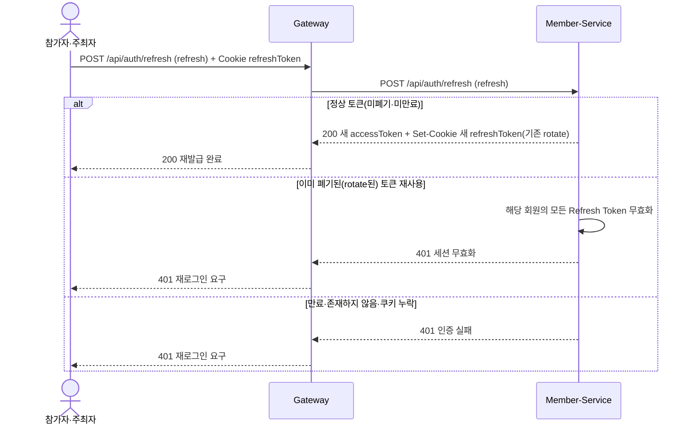
```mermaid
sequenceDiagram
    actor P as 참가자·주최자
    participant G as Gateway
    participant MS as Member-Service
    P->>G: POST /api/auth/refresh (refresh) + Cookie refreshToken
    G->>MS: POST /api/auth/refresh (refresh)
    alt 정상 토큰(미폐기·미만료)
        MS-->>G: 200 새 accessToken + Set-Cookie 새 refreshToken(기존 rotate)
        G-->>P: 200 재발급 완료
    else 이미 폐기된(rotate된) 토큰 재사용
        MS->>MS: 해당 회원의 모든 Refresh Token 무효화
        MS-->>G: 401 세션 무효화
        G-->>P: 401 재로그인 요구
    else 만료·존재하지 않음·쿠키 누락
        MS-->>G: 401 인증 실패
        G-->>P: 401 재로그인 요구
    end
```

### **Story 2 부속 — 로그아웃한다**

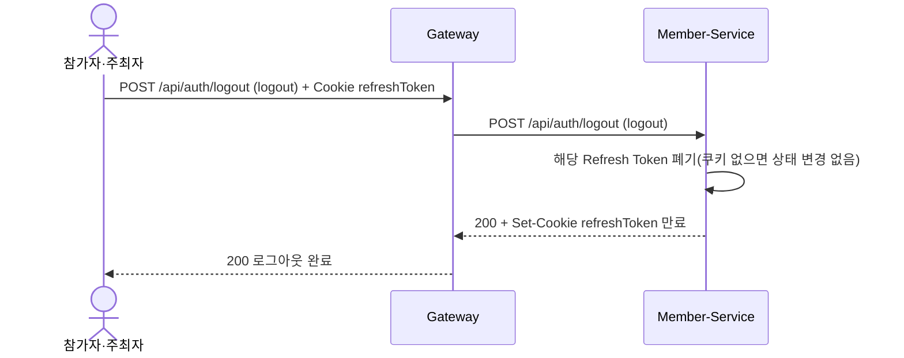
```mermaid
sequenceDiagram
    actor P as 참가자·주최자
    participant G as Gateway
    participant MS as Member-Service
    P->>G: POST /api/auth/logout (logout) + Cookie refreshToken
    G->>MS: POST /api/auth/logout (logout)
    MS->>MS: 해당 Refresh Token 폐기(쿠키 없으면 상태 변경 없음)
    MS-->>G: 200 + Set-Cookie refreshToken 만료
    G-->>P: 200 로그아웃 완료
```

### **Story 3 — 주최자가 사업자등록번호 인증을 거쳐 스스로 회원가입한다 (`#26`)**

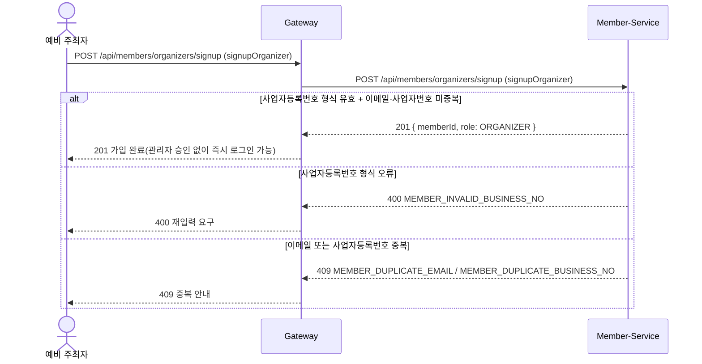
```mermaid
sequenceDiagram
    actor PO as 예비 주최자
    participant G as Gateway
    participant MS as Member-Service
    PO->>G: POST /api/members/organizers/signup (signupOrganizer)
    G->>MS: POST /api/members/organizers/signup (signupOrganizer)
    alt 사업자등록번호 형식 유효 + 이메일·사업자번호 미중복
        MS-->>G: 201 { memberId, role: ORGANIZER }
        G-->>PO: 201 가입 완료(관리자 승인 없이 즉시 로그인 가능)
    else 사업자등록번호 형식 오류
        MS-->>G: 400 MEMBER_INVALID_BUSINESS_NO
        G-->>PO: 400 재입력 요구
    else 이메일 또는 사업자등록번호 중복
        MS-->>G: 409 MEMBER_DUPLICATE_EMAIL / MEMBER_DUPLICATE_BUSINESS_NO
        G-->>PO: 409 중복 안내
    end
```

### **Story 4 — 주최자가 로그인해 권한 범위를 확인한다 (`#28`)**

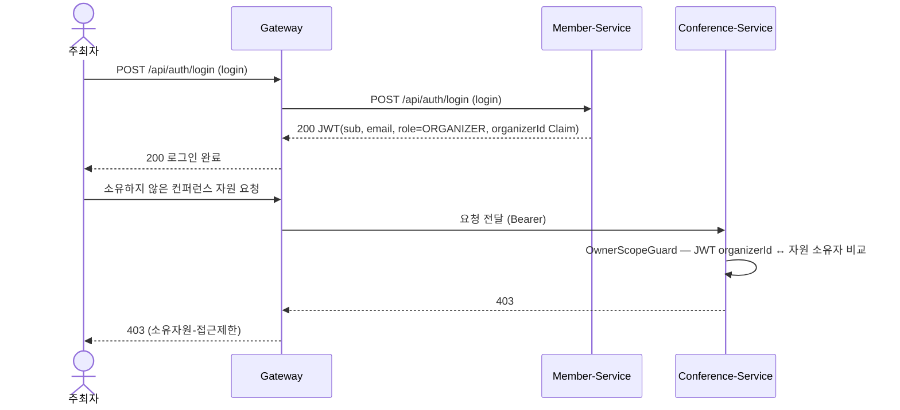
```mermaid
sequenceDiagram
    actor O as 주최자
    participant G as Gateway
    participant MS as Member-Service
    participant CS as Conference-Service
    O->>G: POST /api/auth/login (login)
    G->>MS: POST /api/auth/login (login)
    MS-->>G: 200 JWT(sub, email, role=ORGANIZER, organizerId Claim)
    G-->>O: 200 로그인 완료
    O->>G: 소유하지 않은 컨퍼런스 자원 요청
    G->>CS: 요청 전달 (Bearer)
    CS->>CS: OwnerScopeGuard — JWT organizerId ↔ 자원 소유자 비교
    CS-->>G: 403
    G-->>O: 403 (소유자원-접근제한)
```

### **Story 5 — 주최자가 컨퍼런스를 등록 신청한다 (`#35`)**

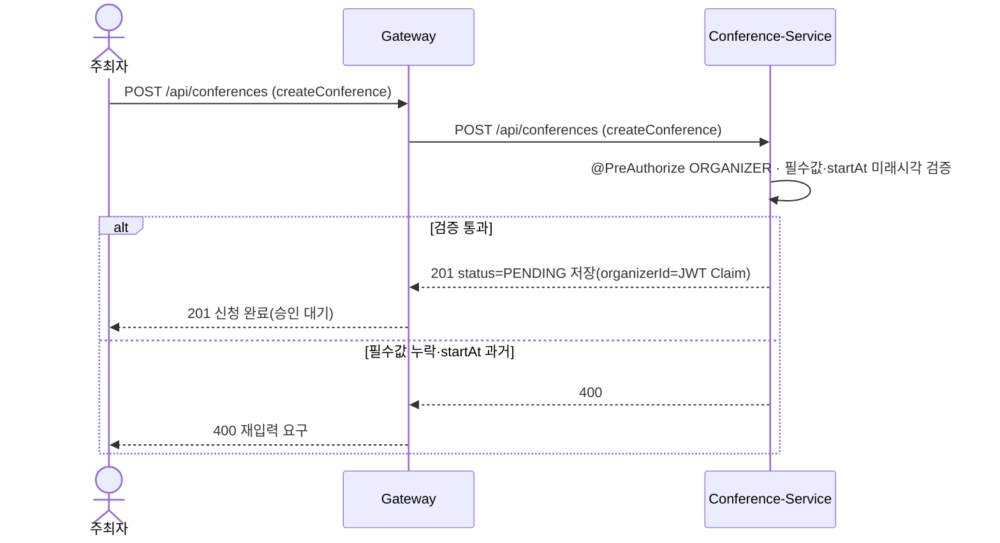
```mermaid
sequenceDiagram
    actor O as 주최자
    participant G as Gateway
    participant CS as Conference-Service
    O->>G: POST /api/conferences (createConference)
    G->>CS: POST /api/conferences (createConference)
    CS->>CS: @PreAuthorize ORGANIZER · 필수값·startAt 미래시각 검증
    alt 검증 통과
        CS-->>G: 201 status=PENDING 저장(organizerId=JWT Claim)
        G-->>O: 201 신청 완료(승인 대기)
    else 필수값 누락·startAt 과거
        CS-->>G: 400
        G-->>O: 400 재입력 요구
    end
```

### **Story 6 — 전체관리자가 신청된 컨퍼런스를 검토해 승인·반려한다 (`#27`)**

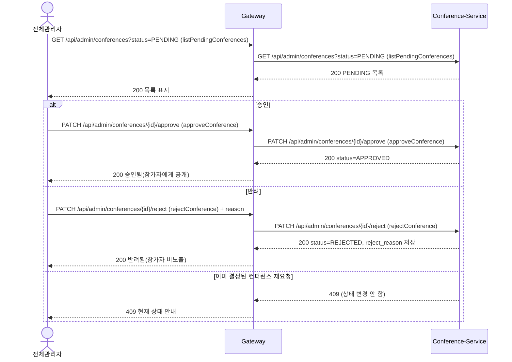
```mermaid
sequenceDiagram
    actor SA as 전체관리자
    participant G as Gateway
    participant CS as Conference-Service
    SA->>G: GET /api/admin/conferences?status=PENDING (listPendingConferences)
    G->>CS: GET /api/admin/conferences?status=PENDING (listPendingConferences)
    CS-->>G: 200 PENDING 목록
    G-->>SA: 200 목록 표시
    alt 승인
        SA->>G: PATCH /api/admin/conferences/{id}/approve (approveConference)
        G->>CS: PATCH /api/admin/conferences/{id}/approve (approveConference)
        CS-->>G: 200 status=APPROVED
        G-->>SA: 200 승인됨(참가자에게 공개)
    else 반려
        SA->>G: PATCH /api/admin/conferences/{id}/reject (rejectConference) + reason
        G->>CS: PATCH /api/admin/conferences/{id}/reject (rejectConference)
        CS-->>G: 200 status=REJECTED, reject_reason 저장
        G-->>SA: 200 반려됨(참가자 비노출)
    else 이미 결정된 컨퍼런스 재요청
        CS-->>G: 409 (상태 변경 안 함)
        G-->>SA: 409 현재 상태 안내
    end
```

### **Story 7 — 주최자가 컨퍼런스에 세션을 등록 신청한다**

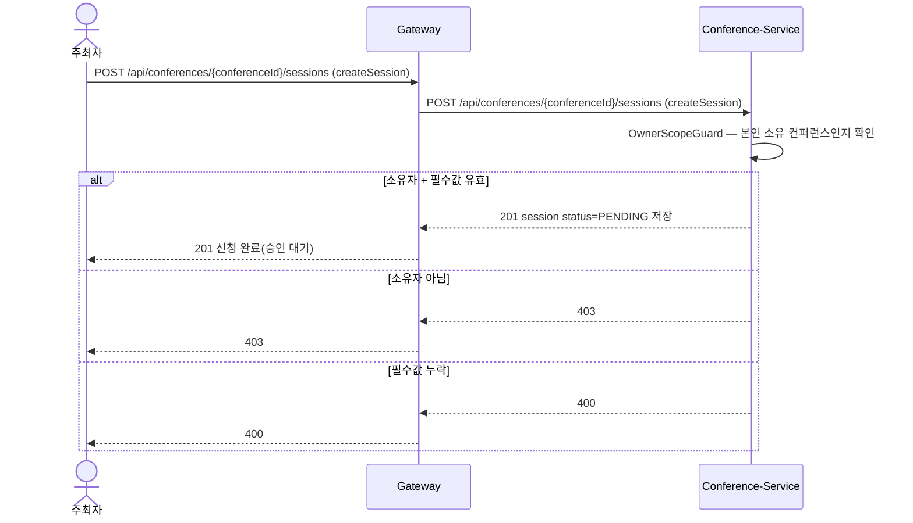
```mermaid
sequenceDiagram
    actor O as 주최자
    participant G as Gateway
    participant CS as Conference-Service
    O->>G: POST /api/conferences/{conferenceId}/sessions (createSession)
    G->>CS: POST /api/conferences/{conferenceId}/sessions (createSession)
    CS->>CS: OwnerScopeGuard — 본인 소유 컨퍼런스인지 확인
    alt 소유자 + 필수값 유효
        CS-->>G: 201 session status=PENDING 저장
        G-->>O: 201 신청 완료(승인 대기)
    else 소유자 아님
        CS-->>G: 403
        G-->>O: 403
    else 필수값 누락
        CS-->>G: 400
        G-->>O: 400
    end
```

### **Story 8 — 전체관리자가 신청된 세션을 검토해 승인·반려한다 (`#68`)**

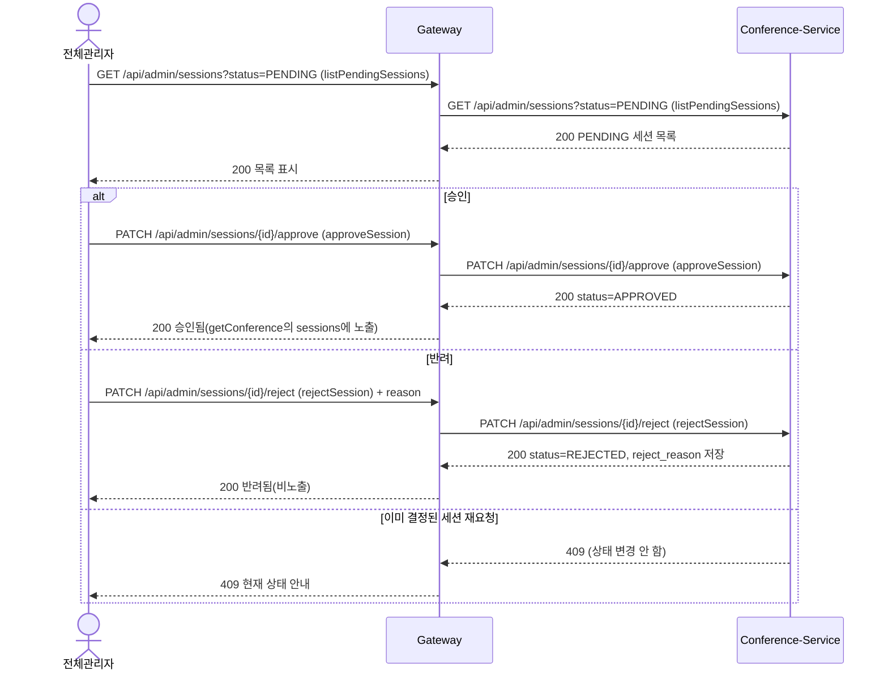
```mermaid
sequenceDiagram
    actor SA as 전체관리자
    participant G as Gateway
    participant CS as Conference-Service
    SA->>G: GET /api/admin/sessions?status=PENDING (listPendingSessions)
    G->>CS: GET /api/admin/sessions?status=PENDING (listPendingSessions)
    CS-->>G: 200 PENDING 세션 목록
    G-->>SA: 200 목록 표시
    alt 승인
        SA->>G: PATCH /api/admin/sessions/{id}/approve (approveSession)
        G->>CS: PATCH /api/admin/sessions/{id}/approve (approveSession)
        CS-->>G: 200 status=APPROVED
        G-->>SA: 200 승인됨(getConference의 sessions에 노출)
    else 반려
        SA->>G: PATCH /api/admin/sessions/{id}/reject (rejectSession) + reason
        G->>CS: PATCH /api/admin/sessions/{id}/reject (rejectSession)
        CS-->>G: 200 status=REJECTED, reject_reason 저장
        G-->>SA: 200 반려됨(비노출)
    else 이미 결정된 세션 재요청
        CS-->>G: 409 (상태 변경 안 함)
        G-->>SA: 409 현재 상태 안내
    end
```

### **Story 9 — 참가자가 세션을 신청한다 (`#20`)**

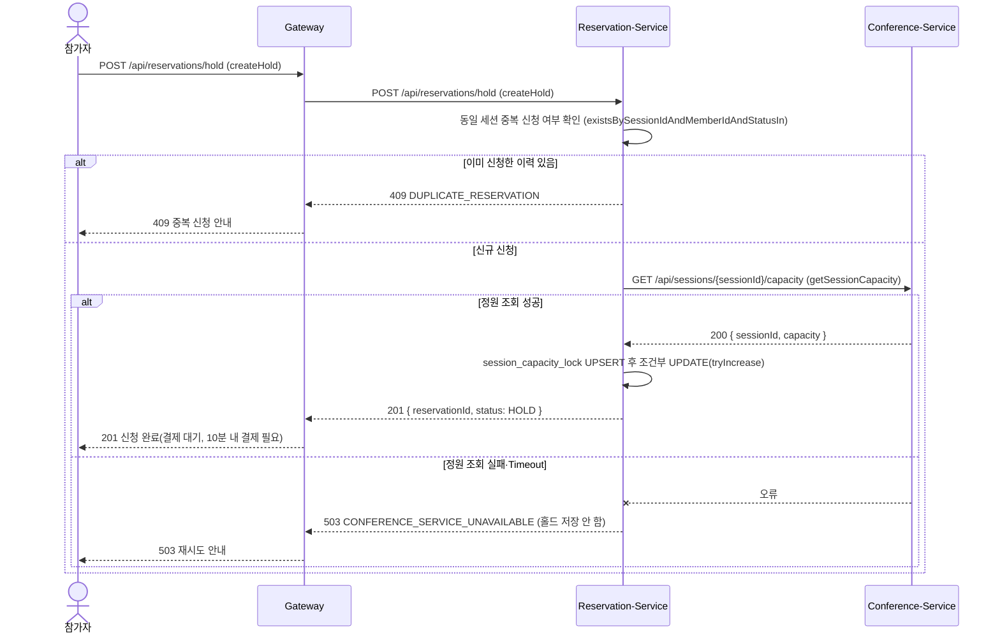
```mermaid
sequenceDiagram
    actor P as 참가자
    participant G as Gateway
    participant RS as Reservation-Service
    participant CS as Conference-Service
    P->>G: POST /api/reservations/hold (createHold)
    G->>RS: POST /api/reservations/hold (createHold)
    RS->>RS: 동일 세션 중복 신청 여부 확인 (existsBySessionIdAndMemberIdAndStatusIn)
    alt 이미 신청한 이력 있음
        RS-->>G: 409 DUPLICATE_RESERVATION
        G-->>P: 409 중복 신청 안내
    else 신규 신청
        RS->>CS: GET /api/sessions/{sessionId}/capacity (getSessionCapacity)
        alt 정원 조회 성공
            CS-->>RS: 200 { sessionId, capacity }
            RS->>RS: session_capacity_lock UPSERT 후 조건부 UPDATE(tryIncrease)
            RS-->>G: 201 { reservationId, status: HOLD }
            G-->>P: 201 신청 완료(결제 대기, 10분 내 결제 필요)
        else 정원 조회 실패·Timeout
            CS--xRS: 오류
            RS-->>G: 503 CONFERENCE_SERVICE_UNAVAILABLE (홀드 저장 안 함)
            G-->>P: 503 재시도 안내
        end
    end
```

### **Story 10 — 정원 임박 세션에 동시 신청이 몰릴 때 대기열로 처리한다 (`#6`)**

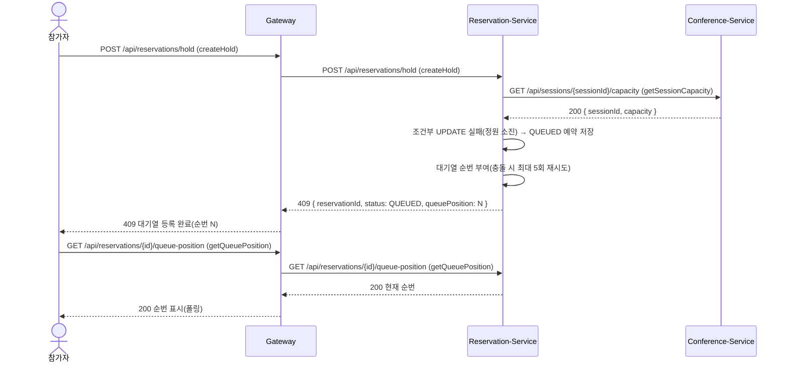
```mermaid
sequenceDiagram
    actor P as 참가자
    participant G as Gateway
    participant RS as Reservation-Service
    participant CS as Conference-Service
    P->>G: POST /api/reservations/hold (createHold)
    G->>RS: POST /api/reservations/hold (createHold)
    RS->>CS: GET /api/sessions/{sessionId}/capacity (getSessionCapacity)
    CS-->>RS: 200 { sessionId, capacity }
    RS->>RS: 조건부 UPDATE 실패(정원 소진) → QUEUED 예약 저장
    RS->>RS: 대기열 순번 부여(충돌 시 최대 5회 재시도)
    RS-->>G: 409 { reservationId, status: QUEUED, queuePosition: N }
    G-->>P: 409 대기열 등록 완료(순번 N)
    P->>G: GET /api/reservations/{id}/queue-position (getQueuePosition)
    G->>RS: GET /api/reservations/{id}/queue-position (getQueuePosition)
    RS-->>G: 200 현재 순번
    G-->>P: 200 순번 표시(폴링)
```

### **Story 11 — 참가자가 결제를 완료한다 (`#72`)**

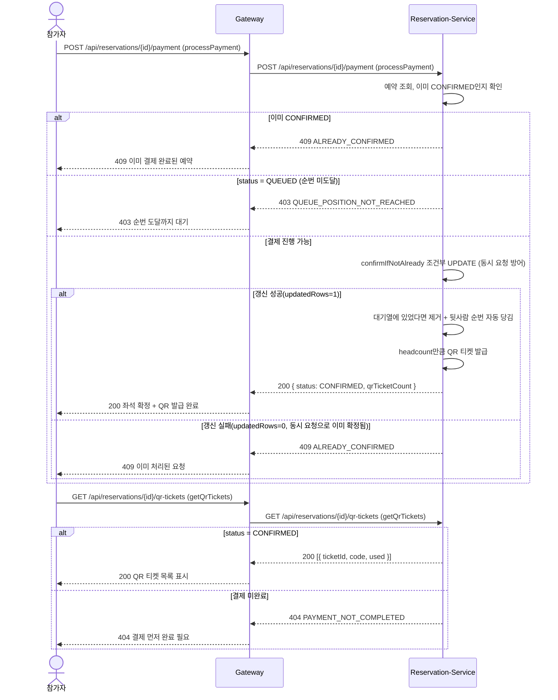
```mermaid
sequenceDiagram
    actor P as 참가자
    participant G as Gateway
    participant RS as Reservation-Service
    P->>G: POST /api/reservations/{id}/payment (processPayment)
    G->>RS: POST /api/reservations/{id}/payment (processPayment)
    RS->>RS: 예약 조회, 이미 CONFIRMED인지 확인
    alt 이미 CONFIRMED
        RS-->>G: 409 ALREADY_CONFIRMED
        G-->>P: 409 이미 결제 완료된 예약
    else status = QUEUED (순번 미도달)
        RS-->>G: 403 QUEUE_POSITION_NOT_REACHED
        G-->>P: 403 순번 도달까지 대기
    else 결제 진행 가능
        RS->>RS: confirmIfNotAlready 조건부 UPDATE (동시 요청 방어)
        alt 갱신 성공(updatedRows=1)
            RS->>RS: 대기열에 있었다면 제거 + 뒷사람 순번 자동 당김
            RS->>RS: headcount만큼 QR 티켓 발급
            RS-->>G: 200 { status: CONFIRMED, qrTicketCount }
            G-->>P: 200 좌석 확정 + QR 발급 완료
        else 갱신 실패(updatedRows=0, 동시 요청으로 이미 확정됨)
            RS-->>G: 409 ALREADY_CONFIRMED
            G-->>P: 409 이미 처리된 요청
        end
    end
    P->>G: GET /api/reservations/{id}/qr-tickets (getQrTickets)
    G->>RS: GET /api/reservations/{id}/qr-tickets (getQrTickets)
    alt status = CONFIRMED
        RS-->>G: 200 [{ ticketId, code, used }]
        G-->>P: 200 QR 티켓 목록 표시
    else 결제 미완료
        RS-->>G: 404 PAYMENT_NOT_COMPLETED
        G-->>P: 404 결제 먼저 완료 필요
    end
```

### **Story 12 — 참가자가 신청을 취소한다**

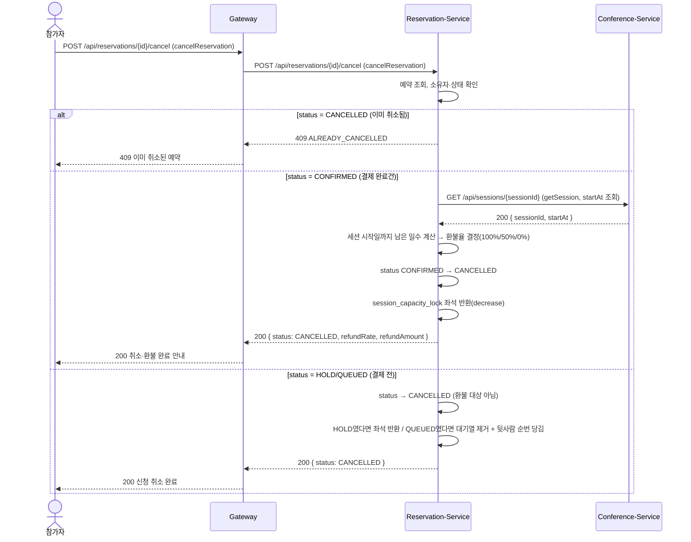
```mermaid
sequenceDiagram
    actor P as 참가자
    participant G as Gateway
    participant RS as Reservation-Service
    participant CS as Conference-Service
    P->>G: POST /api/reservations/{id}/cancel (cancelReservation)
    G->>RS: POST /api/reservations/{id}/cancel (cancelReservation)
    RS->>RS: 예약 조회, 소유자·상태 확인
    alt status = CANCELLED (이미 취소됨)
        RS-->>G: 409 ALREADY_CANCELLED
        G-->>P: 409 이미 취소된 예약
    else status = CONFIRMED (결제 완료건)
        RS->>CS: GET /api/sessions/{sessionId} (getSession, startAt 조회)
        CS-->>RS: 200 { sessionId, startAt }
        RS->>RS: 세션 시작일까지 남은 일수 계산 → 환불율 결정(100%/50%/0%)
        RS->>RS: status CONFIRMED → CANCELLED
        RS->>RS: session_capacity_lock 좌석 반환(decrease)
        RS-->>G: 200 { status: CANCELLED, refundRate, refundAmount }
        G-->>P: 200 취소·환불 완료 안내
    else status = HOLD/QUEUED (결제 전)
        RS->>RS: status → CANCELLED (환불 대상 아님)
        RS->>RS: HOLD였다면 좌석 반환 / QUEUED였다면 대기열 제거 + 뒷사람 순번 당김
        RS-->>G: 200 { status: CANCELLED }
        G-->>P: 200 신청 취소 완료
    end
```

### **Story 13 — 참가자가 QR 티켓으로 입장(세션 체크인)한다**

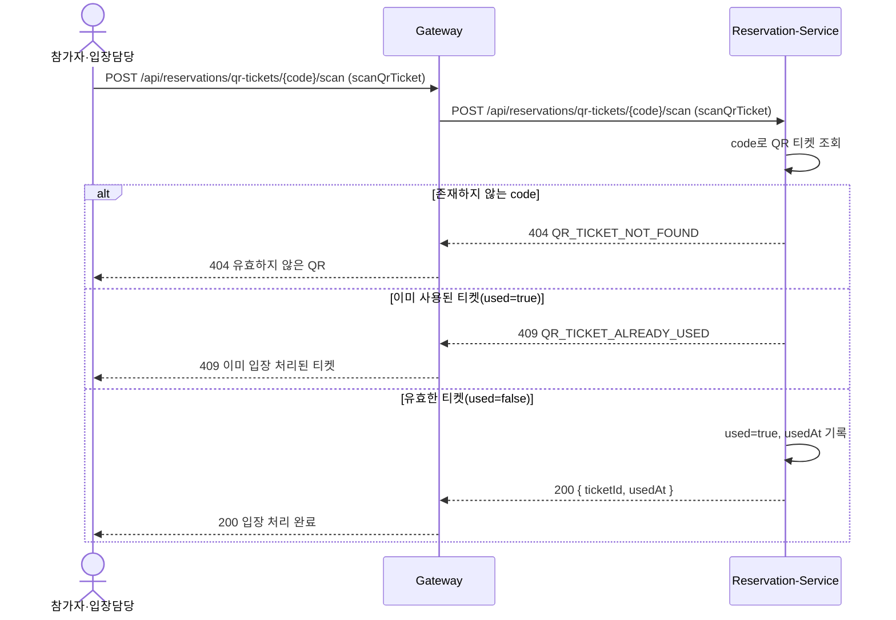
```mermaid
sequenceDiagram
    actor P as 참가자·입장담당
    participant G as Gateway
    participant RS as Reservation-Service
    P->>G: POST /api/reservations/qr-tickets/{code}/scan (scanQrTicket)
    G->>RS: POST /api/reservations/qr-tickets/{code}/scan (scanQrTicket)
    RS->>RS: code로 QR 티켓 조회
    alt 존재하지 않는 code
        RS-->>G: 404 QR_TICKET_NOT_FOUND
        G-->>P: 404 유효하지 않은 QR
    else 이미 사용된 티켓(used=true)
        RS-->>G: 409 QR_TICKET_ALREADY_USED
        G-->>P: 409 이미 입장 처리된 티켓
    else 유효한 티켓(used=false)
        RS->>RS: used=true, usedAt 기록
        RS-->>G: 200 { ticketId, usedAt }
        G-->>P: 200 입장 처리 완료
    end
```

### **Story 15 — 주최자가 컨퍼런스 참석자 통계를 조회한다**

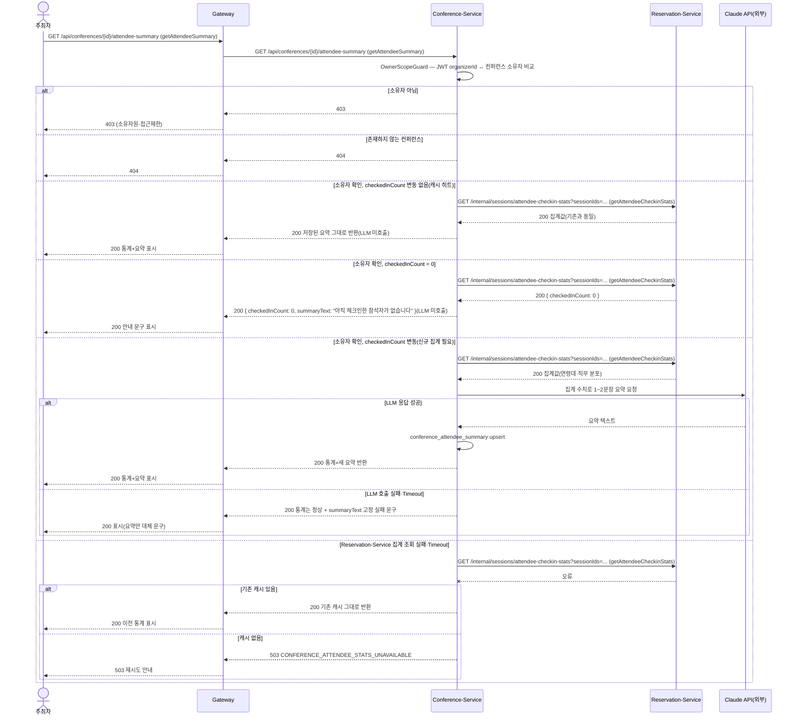
```mermaid
sequenceDiagram
    actor O as 주최자
    participant G as Gateway
    participant CS as Conference-Service
    participant RS as Reservation-Service
    participant AI as Claude API(외부)
    O->>G: GET /api/conferences/{id}/attendee-summary (getAttendeeSummary)
    G->>CS: GET /api/conferences/{id}/attendee-summary (getAttendeeSummary)
    CS->>CS: OwnerScopeGuard — JWT organizerId ↔ 컨퍼런스 소유자 비교
    alt 소유자 아님
        CS-->>G: 403
        G-->>O: 403 (소유자원-접근제한)
    else 존재하지 않는 컨퍼런스
        CS-->>G: 404
        G-->>O: 404
    else 소유자 확인, checkedInCount 변동 없음(캐시 히트)
        CS->>RS: GET /internal/sessions/attendee-checkin-stats?sessionIds=... (getAttendeeCheckinStats)
        RS-->>CS: 200 집계값(기존과 동일)
        CS-->>G: 200 저장된 요약 그대로 반환(LLM 미호출)
        G-->>O: 200 통계+요약 표시
    else 소유자 확인, checkedInCount = 0
        CS->>RS: GET /internal/sessions/attendee-checkin-stats?sessionIds=... (getAttendeeCheckinStats)
        RS-->>CS: 200 { checkedInCount: 0 }
        CS-->>G: 200 { checkedInCount: 0, summaryText: "아직 체크인한 참석자가 없습니다" }(LLM 미호출)
        G-->>O: 200 안내 문구 표시
    else 소유자 확인, checkedInCount 변동(신규 집계 필요)
        CS->>RS: GET /internal/sessions/attendee-checkin-stats?sessionIds=... (getAttendeeCheckinStats)
        RS-->>CS: 200 집계값(연령대·직무 분포)
        CS->>AI: 집계 수치로 1~2문장 요약 요청
        alt LLM 응답 성공
            AI-->>CS: 요약 텍스트
            CS->>CS: conference_attendee_summary upsert
            CS-->>G: 200 통계+새 요약 반환
            G-->>O: 200 통계+요약 표시
        else LLM 호출 실패·Timeout
            CS-->>G: 200 통계는 정상 + summaryText 고정 실패 문구
            G-->>O: 200 표시(요약만 대체 문구)
        end
    else Reservation-Service 집계 조회 실패·Timeout
        CS->>RS: GET /internal/sessions/attendee-checkin-stats?sessionIds=... (getAttendeeCheckinStats)
        RS--xCS: 오류
        alt 기존 캐시 있음
            CS-->>G: 200 기존 캐시 그대로 반환
            G-->>O: 200 이전 통계 표시
        else 캐시 없음
            CS-->>G: 503 CONFERENCE_ATTENDEE_STATS_UNAVAILABLE
            G-->>O: 503 재시도 안내
        end
    end
```

### **Story 19 — 전체관리자가 시스템 설정에서 PG 연동 키를 등록한다**

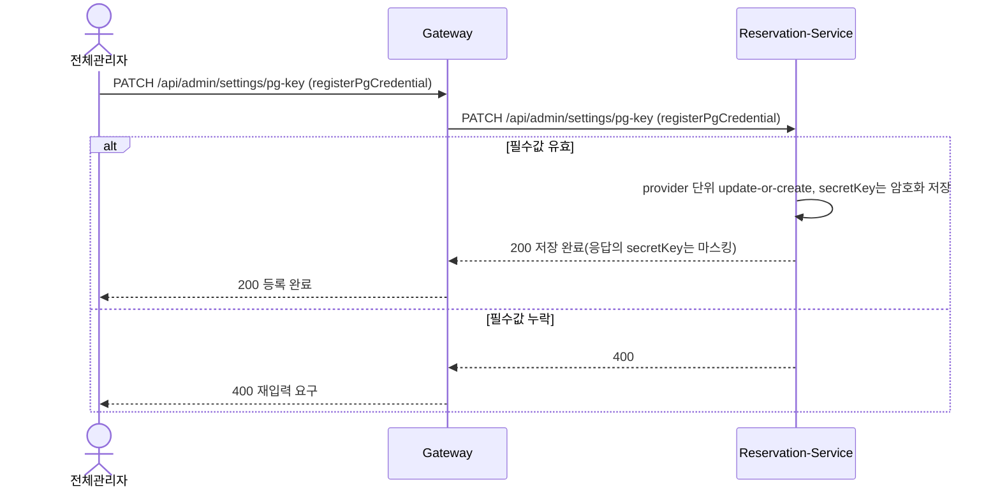
```mermaid
sequenceDiagram
    actor SA as 전체관리자
    participant G as Gateway
    participant RS as Reservation-Service
    SA->>G: PATCH /api/admin/settings/pg-key (registerPgCredential)
    G->>RS: PATCH /api/admin/settings/pg-key (registerPgCredential)
    alt 필수값 유효
        RS->>RS: provider 단위 update-or-create, secretKey는 암호화 저장
        RS-->>G: 200 저장 완료(응답의 secretKey는 마스킹)
        G-->>SA: 200 등록 완료
    else 필수값 누락
        RS-->>G: 400
        G-->>SA: 400 재입력 요구
    end
```

## 실패·복구 흐름

| 시작 조건 | 관련 업무 규칙·계약 | 실패 지점 | 안전한 결과 | 재시도·복구 | 관련 Test·Sprint Demo |
| --- | --- | --- | --- | --- | --- |
| 미승인·존재하지 않는 컨퍼런스 상세 조회 | [승인-전-비공개] / `getConference` | Conference-Service 조회 결과 없음 | `404`(존재 여부 노출 안 함) | 목록으로 복귀 안내 | `ConferenceVisibilityTest` (Task 1-3 `#5`) |
| 이미 가입된 이메일로 회원가입 시도 | [이메일-중복-금지] / `signup` | Member-Service Unique 제약 위반 | `409`, 계정 미생성 | 다른 이메일 재입력 또는 로그인 유도 | `MemberSignupLoginTest` (Task 2-2 `#25`) |
| 세션 정원 조회(`getSessionCapacity`) Timeout·오류 | [정원-초과-금지] / `createHold` | Reservation→Conference 내부 호출 실패 | `503`, 홀드 생성 안 함(Fail-closed) | 클라이언트 재시도 안내 | `CapacityContractFailureTest` (Task 3-2 `#23`) |
| 대기열 순번 미도달 상태에서 결제 진입 시도 | [대기열-순번-제한] / `getQueuePosition` | 결제 진입 게이트(Sprint 2 결제 API 연계) | 결제 API 호출 자체가 거부됨 | 순번 도달까지 폴링 대기 | `WaitingQueueTest` (Task 4-1 `#7`) |
| 주최자가 소유하지 않은 컨퍼런스 자원에 접근 | [소유자원-접근제한] / 전체 `ORGANIZER` API | Cross-cutting 공통 인가 필터 | `403` | 본인 소유 자원으로 재요청 | `OwnerScopeGuardTest` (Task 8-2 `#32`) |
| 필수값 누락 상태로 컨퍼런스 등록 신청 | `createConference` | Conference-Service 입력 검증 | `400`, 저장 안 함 | 필수값 채워 재요청 | `ConferenceApplicationTest` (Task 9-2 `#37`) |
| 전체관리자 권한 없이 승인·반려 API 호출 | [승인-전-비공개] / `approveConference`·`rejectConference` | Gateway 권한 검증(Conference-Service 요청 전 차단) | `403`, 상태 변경 안 함(승인 전 상태 유지, Fail-closed) | 전체관리자 계정으로 재시도 | Task 6-3 Acceptance Test  |
| 이미 폐기(rotate)된 Refresh Token이 다시 제출됨 | refresh (업무 규칙 아님 — 기술 결정) | Member-Service Refresh Token 조회 | `401`, 해당 회원의 모든 Refresh Token 무효화(재사용 탐지) | 재로그인 요구 | MemberSignupLoginTest (Task 2-1 `#9`) |
| 전체관리자 권한 없이 세션 승인·반려 API 호출 | approveSession·rejectSession | Gateway 권한 검증(Conference-Service 요청 전 차단) | 403, 상태 변경 안 함 | 전체관리자 계정으로 재시도 | Task 8-3 Acceptance Test (#71) |
| 이미 결정된 세션에 승인·반려 재요청 | approveSession·rejectSession | Conference-Service 상태 검증 | 409, 상태 변경 안 함 | 현재 상태 확인 후 재시도 | Task 8-3 Acceptance Test (#71) |
| Claude API 호출 Timeout·오류 | [AI요약-실참석기준] / `getAttendeeSummary` | Conference-Service → Claude API 호출 실패 | 통계 수치는 정상 반환, `summaryText`만 고정 실패 문구로 대체(200) | 다음 조회 시 재시도(캐시 갱신 조건 재확인) | (테스트명 미정, Story 15 구현 후 지정) |
| 체크인 집계 조회(`getAttendeeCheckinStats`) Timeout·오류 | [AI요약-실참석기준] / `getAttendeeSummary` | Conference-Service → Reservation-Service 내부 호출 실패 | 기존 캐시 있으면 캐시 반환(200), 없으면 `503`(Fail-closed) | 클라이언트 재시도 안내 | (테스트명 미정, Story 15 구현 후 지정) |

시퀀스에서 Payload를 다시 정의하지 않습니다. 호출 순서에는 실제 `operationId`, method/path, Event 이름을 사용합니다.