# 시퀀스

> **작성·동기화 메타정보**
> 
> 
> Notion 원본 URL: `https://app.notion.com/p/3cd73873401a8002a389e5ee51bebf20`
> 
> Snapshot 기준 시점: `Sprint 4 Review 종료 시점 (2026-09-28)`
> 
> 동기화 시각: `2026-09-29 11:00 KST`
> 
> 직접 편집 금지: Git Snapshot은 직접 편집하지 않고 Notion 원본을 수정한 뒤 다시 동기화합니다.
> 

> 계약: `API·통합 계약` 문서(`docs/API.md`)
관련 Story·Sprint 검증: GitHub Issue(Story/Task 번호 = Issue 번호)
> 

## 정상 흐름

### **Story 1 — 방문자가 컨퍼런스·세션을 검색한다 (`#1`)**

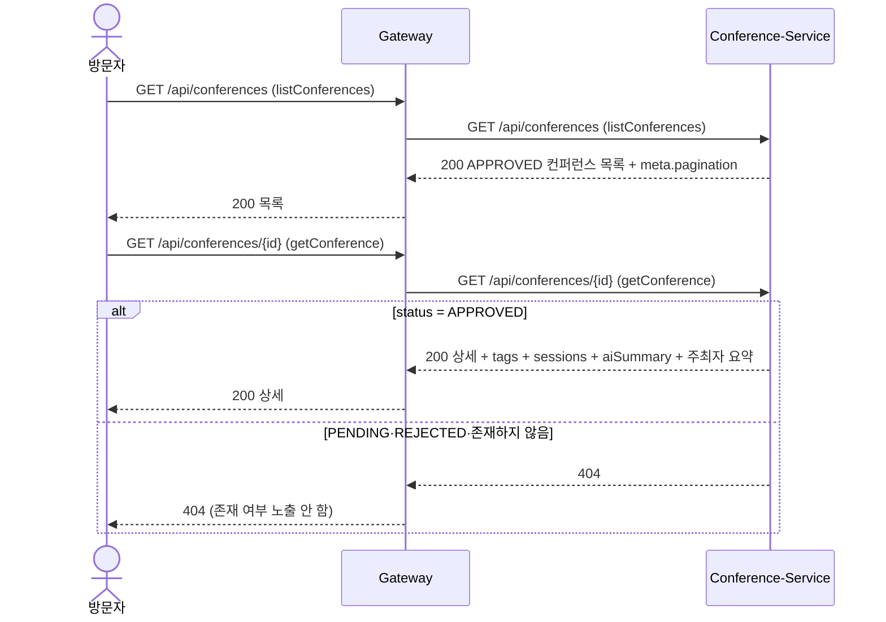
```mermaid
sequenceDiagram
    actor V as 방문자
    participant G as Gateway
    participant CS as Conference-Service
    V->>G: GET /api/conferences (listConferences)
    G->>CS: GET /api/conferences (listConferences)
    CS-->>G: 200 APPROVED 컨퍼런스 목록 + meta.pagination
    G-->>V: 200 목록
    V->>G: GET /api/conferences/{id} (getConference)
    G->>CS: GET /api/conferences/{id} (getConference)
    alt status = APPROVED
        CS-->>G: 200 상세 + tags + sessions + aiSummary + 주최자 요약
        G-->>V: 200 상세
    else PENDING·REJECTED·존재하지 않음
        CS-->>G: 404
        G-->>V: 404 (존재 여부 노출 안 함)
    end
```

### **Story 2 — 방문자가 회원가입한다 (`#3`)**

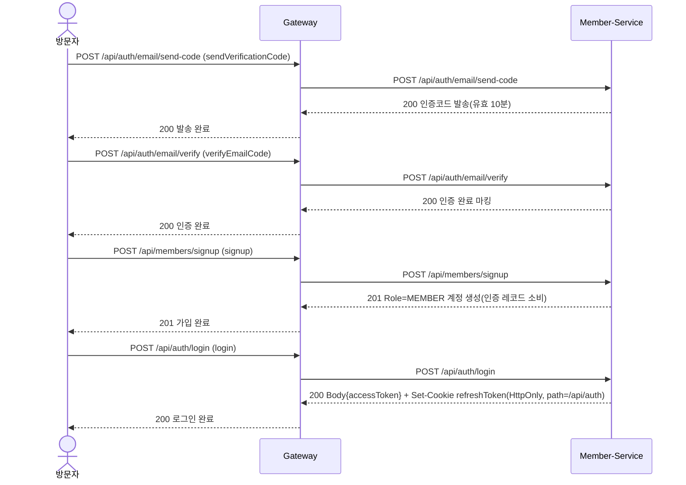
```mermaid
sequenceDiagram
    actor V as 방문자
    participant G as Gateway
    participant MS as Member-Service
    V->>G: POST /api/auth/email/send-code (sendVerificationCode)
    G->>MS: POST /api/auth/email/send-code
    MS-->>G: 200 인증코드 발송(유효 10분)
    G-->>V: 200 발송 완료
    V->>G: POST /api/auth/email/verify (verifyEmailCode)
    G->>MS: POST /api/auth/email/verify
    MS-->>G: 200 인증 완료 마킹
    G-->>V: 200 인증 완료
    V->>G: POST /api/members/signup (signup)
    G->>MS: POST /api/members/signup
    MS-->>G: 201 Role=MEMBER 계정 생성(인증 레코드 소비)
    G-->>V: 201 가입 완료
    V->>G: POST /api/auth/login (login)
    G->>MS: POST /api/auth/login
    MS-->>G: 200 Body{accessToken} + Set-Cookie refreshToken(HttpOnly, path=/api/auth)
    G-->>V: 200 로그인 완료
```

### **Story 2 부속 — Refresh Token으로 Access Token을 재발급한다**

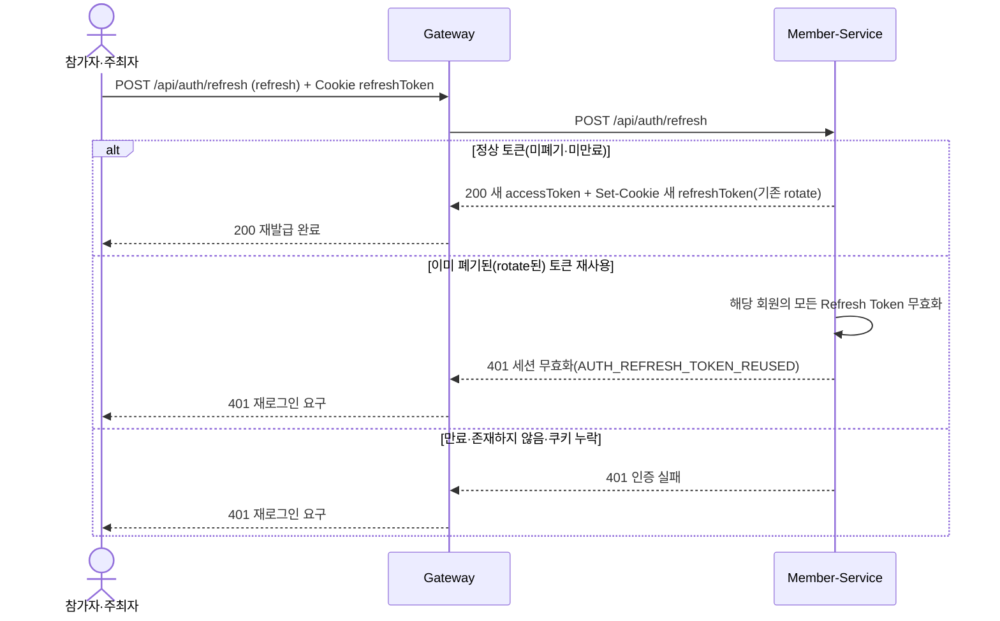
```mermaid
sequenceDiagram
    actor P as 참가자·주최자
    participant G as Gateway
    participant MS as Member-Service
    P->>G: POST /api/auth/refresh (refresh) + Cookie refreshToken
    G->>MS: POST /api/auth/refresh
    alt 정상 토큰(미폐기·미만료)
        MS-->>G: 200 새 accessToken + Set-Cookie 새 refreshToken(기존 rotate)
        G-->>P: 200 재발급 완료
    else 이미 폐기된(rotate된) 토큰 재사용
        MS->>MS: 해당 회원의 모든 Refresh Token 무효화
        MS-->>G: 401 세션 무효화(AUTH_REFRESH_TOKEN_REUSED)
        G-->>P: 401 재로그인 요구
    else 만료·존재하지 않음·쿠키 누락
        MS-->>G: 401 인증 실패
        G-->>P: 401 재로그인 요구
    end
```

### **Story 2 부속 — 로그아웃한다**

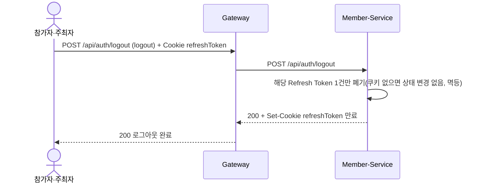
```mermaid
sequenceDiagram
    actor P as 참가자·주최자
    participant G as Gateway
    participant MS as Member-Service
    P->>G: POST /api/auth/logout (logout) + Cookie refreshToken
    G->>MS: POST /api/auth/logout
    MS->>MS: 해당 Refresh Token 1건만 폐기(쿠키 없으면 상태 변경 없음, 멱등)
    MS-->>G: 200 + Set-Cookie refreshToken 만료
    G-->>P: 200 로그아웃 완료
```

### **Story 3 — 주최자가 사업자등록번호 인증을 거쳐 스스로 회원가입한다 (`#26`)**

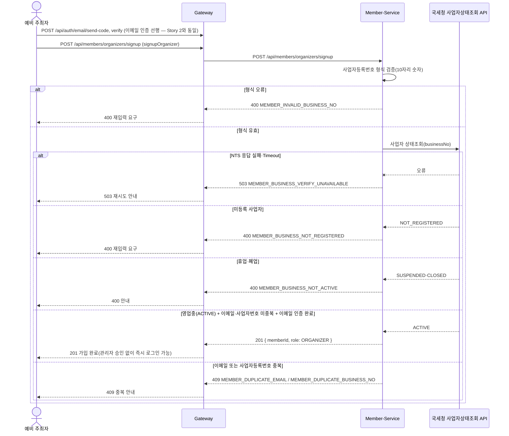
```mermaid
sequenceDiagram
    actor PO as 예비 주최자
    participant G as Gateway
    participant MS as Member-Service
    participant NTS as 국세청 사업자상태조회 API
    PO->>G: POST /api/auth/email/send-code, verify (이메일 인증 선행 — Story 2와 동일)
    PO->>G: POST /api/members/organizers/signup (signupOrganizer)
    G->>MS: POST /api/members/organizers/signup
    MS->>MS: 사업자등록번호 형식 검증(10자리 숫자)
    alt 형식 오류
        MS-->>G: 400 MEMBER_INVALID_BUSINESS_NO
        G-->>PO: 400 재입력 요구
    else 형식 유효
        MS->>NTS: 사업자 상태조회(businessNo)
        alt NTS 응답 실패·Timeout
            NTS--xMS: 오류
            MS-->>G: 503 MEMBER_BUSINESS_VERIFY_UNAVAILABLE
            G-->>PO: 503 재시도 안내
        else 미등록 사업자
            NTS-->>MS: NOT_REGISTERED
            MS-->>G: 400 MEMBER_BUSINESS_NOT_REGISTERED
            G-->>PO: 400 재입력 요구
        else 휴업·폐업
            NTS-->>MS: SUSPENDED·CLOSED
            MS-->>G: 400 MEMBER_BUSINESS_NOT_ACTIVE
            G-->>PO: 400 안내
        else 영업중(ACTIVE) + 이메일·사업자번호 미중복 + 이메일 인증 완료
            NTS-->>MS: ACTIVE
            MS-->>G: 201 { memberId, role: ORGANIZER }
            G-->>PO: 201 가입 완료(관리자 승인 없이 즉시 로그인 가능)
        else 이메일 또는 사업자등록번호 중복
            MS-->>G: 409 MEMBER_DUPLICATE_EMAIL / MEMBER_DUPLICATE_BUSINESS_NO
            G-->>PO: 409 중복 안내
        end
    end
```

### **Story 4 — 주최자가 로그인해 권한 범위를 확인한다 (`#28`)**

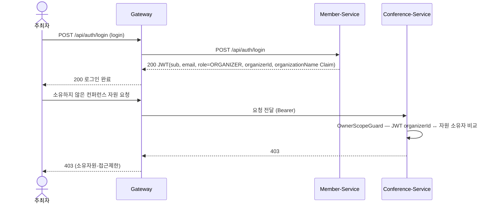
```mermaid
sequenceDiagram
    actor O as 주최자
    participant G as Gateway
    participant MS as Member-Service
    participant CS as Conference-Service
    O->>G: POST /api/auth/login (login)
    G->>MS: POST /api/auth/login
    MS-->>G: 200 JWT(sub, email, role=ORGANIZER, organizerId, organizationName Claim)
    G-->>O: 200 로그인 완료
    O->>G: 소유하지 않은 컨퍼런스 자원 요청
    G->>CS: 요청 전달 (Bearer)
    CS->>CS: OwnerScopeGuard — JWT organizerId ↔ 자원 소유자 비교
    CS-->>G: 403
    G-->>O: 403 (소유자원-접근제한)
```

### **Story 22 — 참석자가 소셜 로그인으로 회원가입·로그인한다 (`#234`)**

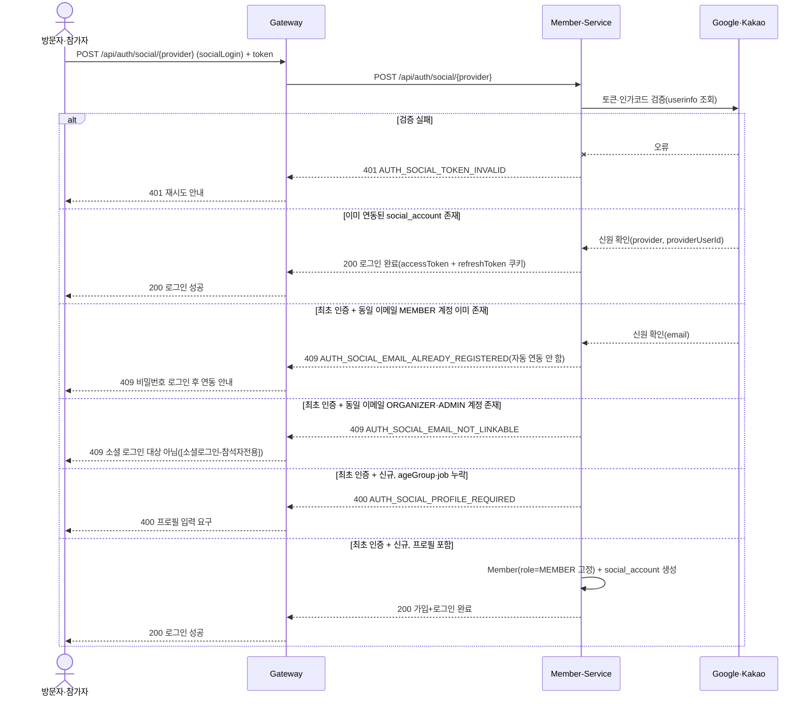
```mermaid
sequenceDiagram
    actor V as 방문자·참가자
    participant G as Gateway
    participant MS as Member-Service
    participant SP as Google·Kakao
    V->>G: POST /api/auth/social/{provider} (socialLogin) + token
    G->>MS: POST /api/auth/social/{provider}
    MS->>SP: 토큰·인가코드 검증(userinfo 조회)
    alt 검증 실패
        SP--xMS: 오류
        MS-->>G: 401 AUTH_SOCIAL_TOKEN_INVALID
        G-->>V: 401 재시도 안내
    else 이미 연동된 social_account 존재
        SP-->>MS: 신원 확인(provider, providerUserId)
        MS-->>G: 200 로그인 완료(accessToken + refreshToken 쿠키)
        G-->>V: 200 로그인 성공
    else 최초 인증 + 동일 이메일 MEMBER 계정 이미 존재
        SP-->>MS: 신원 확인(email)
        MS-->>G: 409 AUTH_SOCIAL_EMAIL_ALREADY_REGISTERED(자동 연동 안 함)
        G-->>V: 409 비밀번호 로그인 후 연동 안내
    else 최초 인증 + 동일 이메일 ORGANIZER·ADMIN 계정 존재
        MS-->>G: 409 AUTH_SOCIAL_EMAIL_NOT_LINKABLE
        G-->>V: 409 소셜 로그인 대상 아님([소셜로그인-참석자전용])
    else 최초 인증 + 신규, ageGroup·job 누락
        MS-->>G: 400 AUTH_SOCIAL_PROFILE_REQUIRED
        G-->>V: 400 프로필 입력 요구
    else 최초 인증 + 신규, 프로필 포함
        MS->>MS: Member(role=MEMBER 고정) + social_account 생성
        MS-->>G: 200 가입+로그인 완료
        G-->>V: 200 로그인 성공
    end
```

### **Story 22 부속 — 로그인 중인 계정에 소셜 계정을 연동한다**

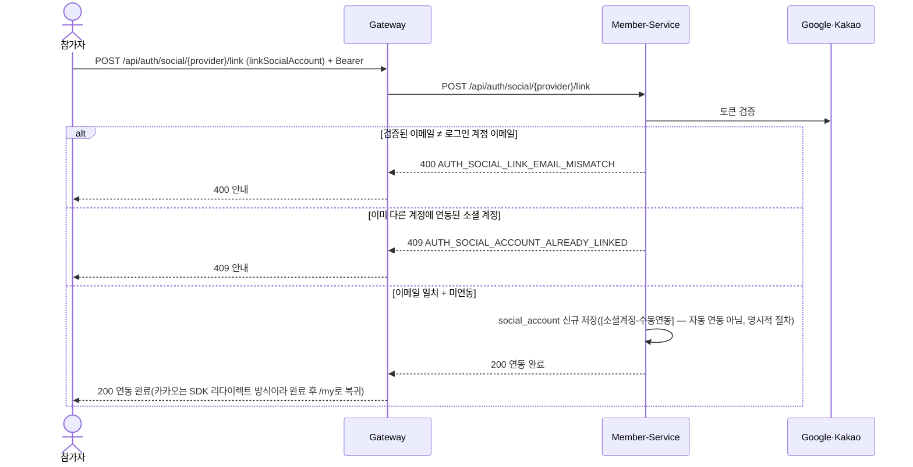
```mermaid
sequenceDiagram
    actor P as 참가자
    participant G as Gateway
    participant MS as Member-Service
    participant SP as Google·Kakao
    P->>G: POST /api/auth/social/{provider}/link (linkSocialAccount) + Bearer
    G->>MS: POST /api/auth/social/{provider}/link
    MS->>SP: 토큰 검증
    alt 검증된 이메일 ≠ 로그인 계정 이메일
        MS-->>G: 400 AUTH_SOCIAL_LINK_EMAIL_MISMATCH
        G-->>P: 400 안내
    else 이미 다른 계정에 연동된 소셜 계정
        MS-->>G: 409 AUTH_SOCIAL_ACCOUNT_ALREADY_LINKED
        G-->>P: 409 안내
    else 이메일 일치 + 미연동
        MS->>MS: social_account 신규 저장([소셜계정-수동연동] — 자동 연동 아님, 명시적 절차)
        MS-->>G: 200 연동 완료
        G-->>P: 200 연동 완료(카카오는 SDK 리다이렉트 방식이라 완료 후 /my로 복귀)
    end
```

### **Story 23 — 회원이 비밀번호를 잊었을 때 재설정한다 (`#235`)**

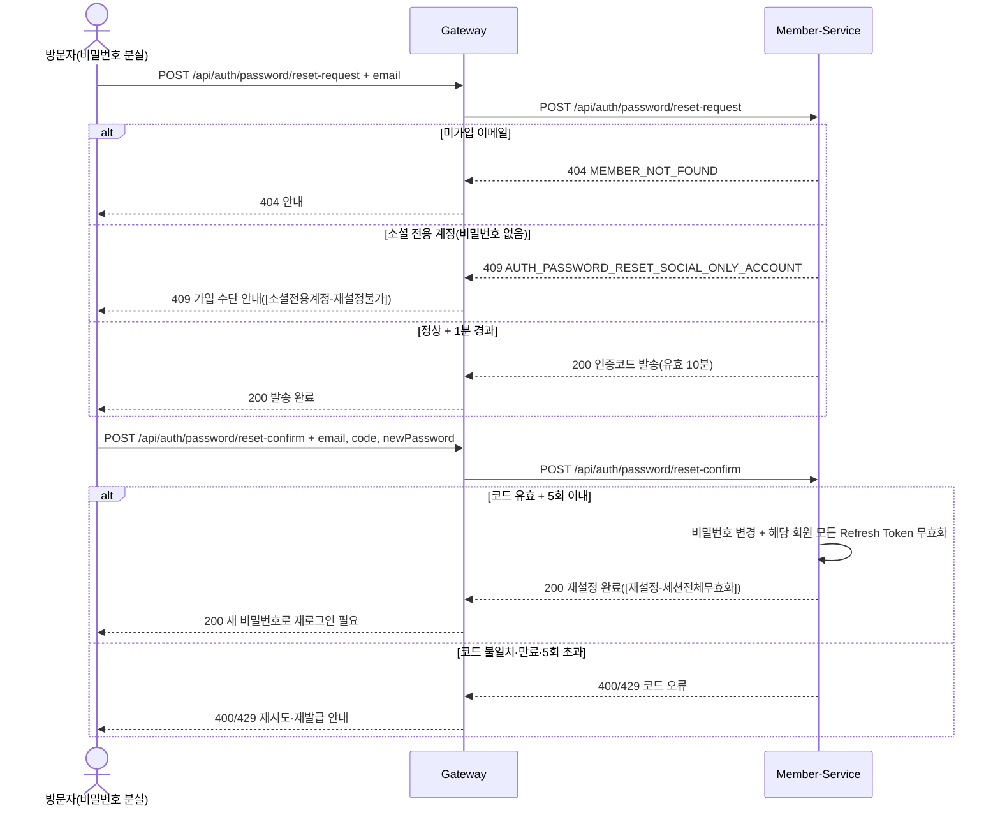
```mermaid
sequenceDiagram
    actor V as 방문자(비밀번호 분실)
    participant G as Gateway
    participant MS as Member-Service
    V->>G: POST /api/auth/password/reset-request + email
    G->>MS: POST /api/auth/password/reset-request
    alt 미가입 이메일
        MS-->>G: 404 MEMBER_NOT_FOUND
        G-->>V: 404 안내
    else 소셜 전용 계정(비밀번호 없음)
        MS-->>G: 409 AUTH_PASSWORD_RESET_SOCIAL_ONLY_ACCOUNT
        G-->>V: 409 가입 수단 안내([소셜전용계정-재설정불가])
    else 정상 + 1분 경과
        MS-->>G: 200 인증코드 발송(유효 10분)
        G-->>V: 200 발송 완료
    end
    V->>G: POST /api/auth/password/reset-confirm + email, code, newPassword
    G->>MS: POST /api/auth/password/reset-confirm
    alt 코드 유효 + 5회 이내
        MS->>MS: 비밀번호 변경 + 해당 회원 모든 Refresh Token 무효화
        MS-->>G: 200 재설정 완료([재설정-세션전체무효화])
        G-->>V: 200 새 비밀번호로 재로그인 필요
    else 코드 불일치·만료·5회 초과
        MS-->>G: 400/429 코드 오류
        G-->>V: 400/429 재시도·재발급 안내
    end
```

### **Story 24 — 회원이 탈퇴한다 (`#236`)**

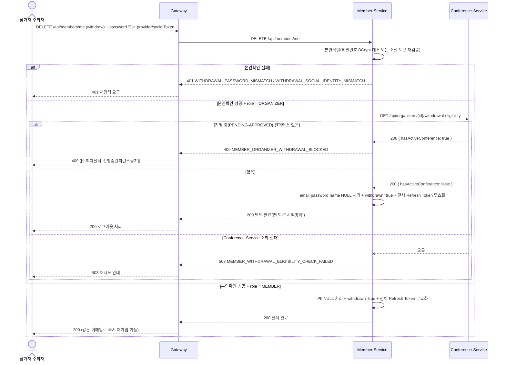
```mermaid
sequenceDiagram
    actor M as 참가자·주최자
    participant G as Gateway
    participant MS as Member-Service
    participant CS as Conference-Service
    M->>G: DELETE /api/members/me (withdraw) + password 또는 provider/socialToken
    G->>MS: DELETE /api/members/me
    MS->>MS: 본인확인(비밀번호 BCrypt 대조 또는 소셜 토큰 재검증)
    alt 본인확인 실패
        MS-->>G: 401 WITHDRAWAL_PASSWORD_MISMATCH / WITHDRAWAL_SOCIAL_IDENTITY_MISMATCH
        G-->>M: 401 재입력 요구
    else 본인확인 성공 + role = ORGANIZER
        MS->>CS: GET /api/organizers/{id}/withdrawal-eligibility
        alt 진행 중(PENDING·APPROVED) 컨퍼런스 있음
            CS-->>MS: 200 { hasActiveConference: true }
            MS-->>G: 409 MEMBER_ORGANIZER_WITHDRAWAL_BLOCKED
            G-->>M: 409 ([주최자탈퇴-진행중컨퍼런스금지])
        else 없음
            CS-->>MS: 200 { hasActiveConference: false }
            MS->>MS: email·password·name NULL 처리 + withdrawn=true + 전체 Refresh Token 무효화
            MS-->>G: 200 탈퇴 완료([탈퇴-즉시익명화])
            G-->>M: 200 로그아웃 처리
        else Conference-Service 조회 실패
            CS--xMS: 오류
            MS-->>G: 503 MEMBER_WITHDRAWAL_ELIGIBILITY_CHECK_FAILED
            G-->>M: 503 재시도 안내
        end
    else 본인확인 성공 + role = MEMBER
        MS->>MS: PII NULL 처리 + withdrawn=true + 전체 Refresh Token 무효화
        MS-->>G: 200 탈퇴 완료
        G-->>M: 200 (같은 이메일로 즉시 재가입 가능)
    end
```

### **Story 18 부속 — 전체관리자가 회원 목록·상세·권한을 조회·변경한다 (`#150` 하위 Task 18-4·18-5)**

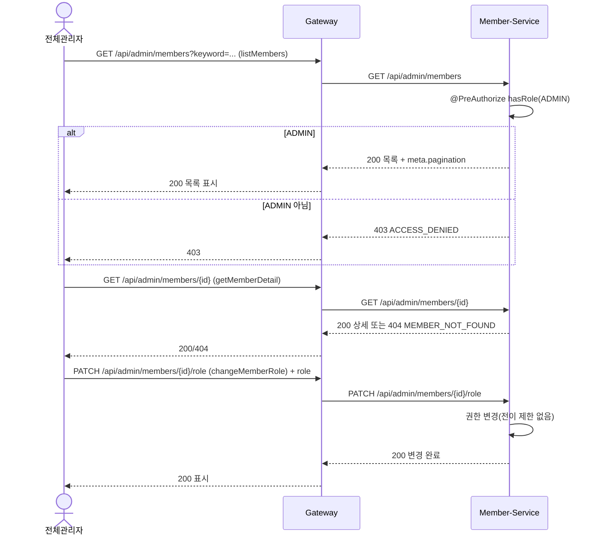
```mermaid
sequenceDiagram
    actor SA as 전체관리자
    participant G as Gateway
    participant MS as Member-Service
    SA->>G: GET /api/admin/members?keyword=... (listMembers)
    G->>MS: GET /api/admin/members
    MS->>MS: @PreAuthorize hasRole(ADMIN)
    alt ADMIN
        MS-->>G: 200 목록 + meta.pagination
        G-->>SA: 200 목록 표시
    else ADMIN 아님
        MS-->>G: 403 ACCESS_DENIED
        G-->>SA: 403
    end
    SA->>G: GET /api/admin/members/{id} (getMemberDetail)
    G->>MS: GET /api/admin/members/{id}
    MS-->>G: 200 상세 또는 404 MEMBER_NOT_FOUND
    G-->>SA: 200/404
    SA->>G: PATCH /api/admin/members/{id}/role (changeMemberRole) + role
    G->>MS: PATCH /api/admin/members/{id}/role
    MS->>MS: 권한 변경(전이 제한 없음)
    MS-->>G: 200 변경 완료
    G-->>SA: 200 표시
```

### **Story 5 — 주최자가 컨퍼런스를 등록 신청하고 소개글을 설정한다 (`#35`, multipart)**

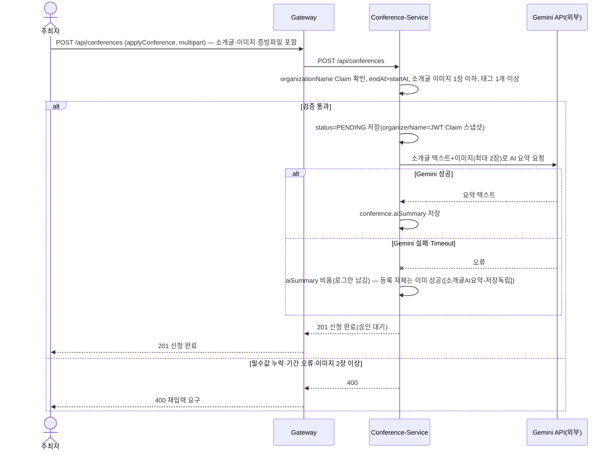
```mermaid
sequenceDiagram
    actor O as 주최자
    participant G as Gateway
    participant CS as Conference-Service
    participant AI as Gemini API(외부)
    O->>G: POST /api/conferences (applyConference, multipart) — 소개글·이미지·증빙파일 포함
    G->>CS: POST /api/conferences
    CS->>CS: organizationName Claim 확인, endAt>startAt, 소개글 이미지 1장 이하, 태그 1개 이상
    alt 검증 통과
        CS->>CS: status=PENDING 저장(organizerName=JWT Claim 스냅샷)
        CS->>AI: 소개글 텍스트+이미지(최대 2장)로 AI 요약 요청
        alt Gemini 성공
            AI-->>CS: 요약 텍스트
            CS->>CS: conference.aiSummary 저장
        else Gemini 실패·Timeout
            AI--xCS: 오류
            CS->>CS: aiSummary 비움(로그만 남김) — 등록 자체는 이미 성공([소개글AI요약-저장독립])
        end
        CS-->>G: 201 신청 완료(승인 대기)
        G-->>O: 201 신청 완료
    else 필수값 누락·기간 오류·이미지 2장 이상
        CS-->>G: 400
        G-->>O: 400 재입력 요구
    end
```

### **Story 5 부속 — 주최자가 승인된 컨퍼런스의 소개글·장소를 수정한다**

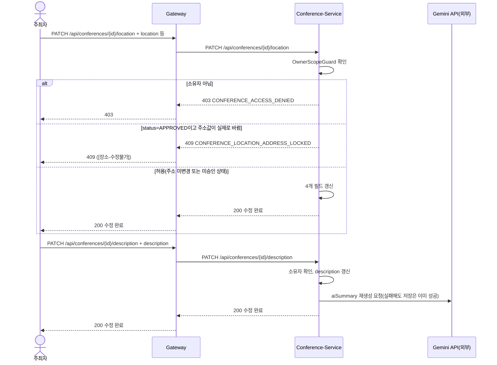
```mermaid
sequenceDiagram
    actor O as 주최자
    participant G as Gateway
    participant CS as Conference-Service
    participant AI as Gemini API(외부)
    O->>G: PATCH /api/conferences/{id}/location + location 등
    G->>CS: PATCH /api/conferences/{id}/location
    CS->>CS: OwnerScopeGuard 확인
    alt 소유자 아님
        CS-->>G: 403 CONFERENCE_ACCESS_DENIED
        G-->>O: 403
    else status=APPROVED이고 주소값이 실제로 바뀜
        CS-->>G: 409 CONFERENCE_LOCATION_ADDRESS_LOCKED
        G-->>O: 409 ([장소-수정불가])
    else 허용(주소 미변경 또는 미승인 상태)
        CS->>CS: 4개 필드 갱신
        CS-->>G: 200 수정 완료
        G-->>O: 200 수정 완료
    end
    O->>G: PATCH /api/conferences/{id}/description + description
    G->>CS: PATCH /api/conferences/{id}/description
    CS->>CS: 소유자 확인, description 갱신
    CS->>AI: aiSummary 재생성 요청(실패해도 저장은 이미 성공)
    CS-->>G: 200 수정 완료
    G-->>O: 200 수정 완료
```

### **Story 6 — 전체관리자가 신청된 컨퍼런스를 검토해 승인·반려한다 (`#27`)**

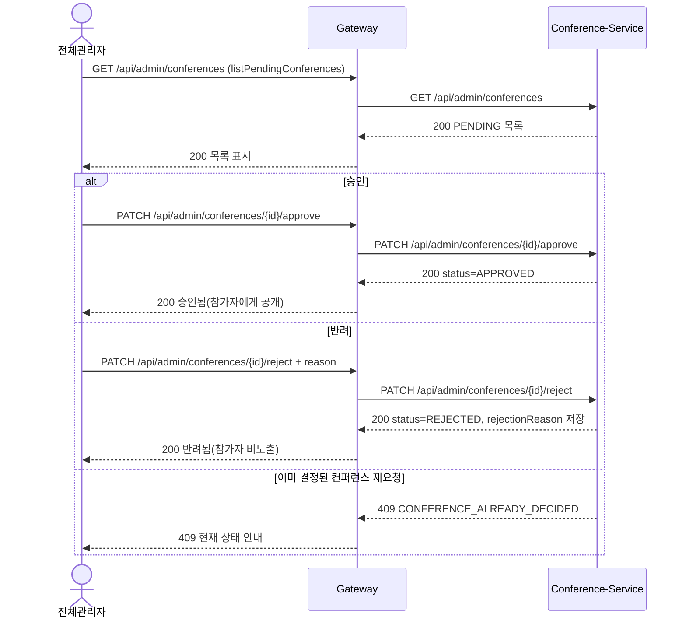
```mermaid
sequenceDiagram
    actor SA as 전체관리자
    participant G as Gateway
    participant CS as Conference-Service
    SA->>G: GET /api/admin/conferences (listPendingConferences)
    G->>CS: GET /api/admin/conferences
    CS-->>G: 200 PENDING 목록
    G-->>SA: 200 목록 표시
    alt 승인
        SA->>G: PATCH /api/admin/conferences/{id}/approve
        G->>CS: PATCH /api/admin/conferences/{id}/approve
        CS-->>G: 200 status=APPROVED
        G-->>SA: 200 승인됨(참가자에게 공개)
    else 반려
        SA->>G: PATCH /api/admin/conferences/{id}/reject + reason
        G->>CS: PATCH /api/admin/conferences/{id}/reject
        CS-->>G: 200 status=REJECTED, rejectionReason 저장
        G-->>SA: 200 반려됨(참가자 비노출)
    else 이미 결정된 컨퍼런스 재요청
        CS-->>G: 409 CONFERENCE_ALREADY_DECIDED
        G-->>SA: 409 현재 상태 안내
    end
```

### **Story 7 — 주최자가 승인된 컨퍼런스에 세션을 등록·수정한다 (`#80`)**

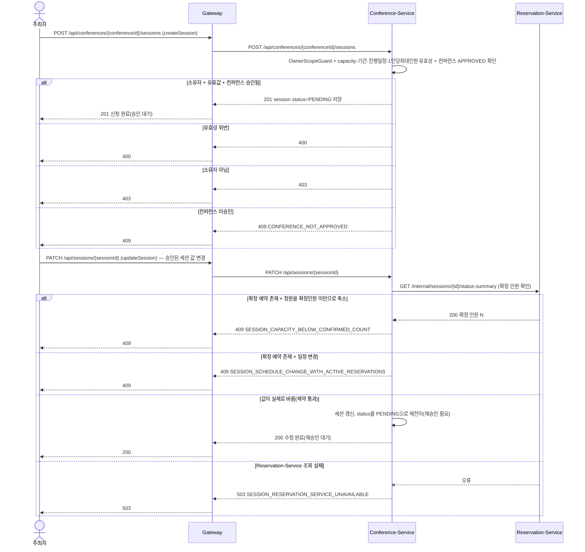
```mermaid
sequenceDiagram
    actor O as 주최자
    participant G as Gateway
    participant CS as Conference-Service
    participant RS as Reservation-Service
    O->>G: POST /api/conferences/{conferenceId}/sessions (createSession)
    G->>CS: POST /api/conferences/{conferenceId}/sessions
    CS->>CS: OwnerScopeGuard + capacity·기간·진행일정·1인당최대인원 유효성 + 컨퍼런스 APPROVED 확인
    alt 소유자 + 유효값 + 컨퍼런스 승인됨
        CS-->>G: 201 session status=PENDING 저장
        G-->>O: 201 신청 완료(승인 대기)
    else 유효성 위반
        CS-->>G: 400
        G-->>O: 400
    else 소유자 아님
        CS-->>G: 403
        G-->>O: 403
    else 컨퍼런스 미승인
        CS-->>G: 409 CONFERENCE_NOT_APPROVED
        G-->>O: 409
    end
    O->>G: PATCH /api/sessions/{sessionId} (updateSession) — 승인된 세션 값 변경
    G->>CS: PATCH /api/sessions/{sessionId}
    CS->>RS: GET /internal/sessions/{id}/status-summary (확정 인원 확인)
    alt 확정 예약 존재 + 정원을 확정인원 미만으로 축소
        RS-->>CS: 200 확정 인원 N
        CS-->>G: 409 SESSION_CAPACITY_BELOW_CONFIRMED_COUNT
        G-->>O: 409
    else 확정 예약 존재 + 일정 변경
        CS-->>G: 409 SESSION_SCHEDULE_CHANGE_WITH_ACTIVE_RESERVATIONS
        G-->>O: 409
    else 값이 실제로 바뀜(제약 통과)
        CS->>CS: 세션 갱신, status를 PENDING으로 재전이(재승인 필요)
        CS-->>G: 200 수정 완료(재승인 대기)
        G-->>O: 200
    else Reservation-Service 조회 실패
        RS--xCS: 오류
        CS-->>G: 503 SESSION_RESERVATION_SERVICE_UNAVAILABLE
        G-->>O: 503
    end
```

### **Story 8 — 전체관리자가 신청된 세션을 검토해 승인·반려한다 (`#68`)**

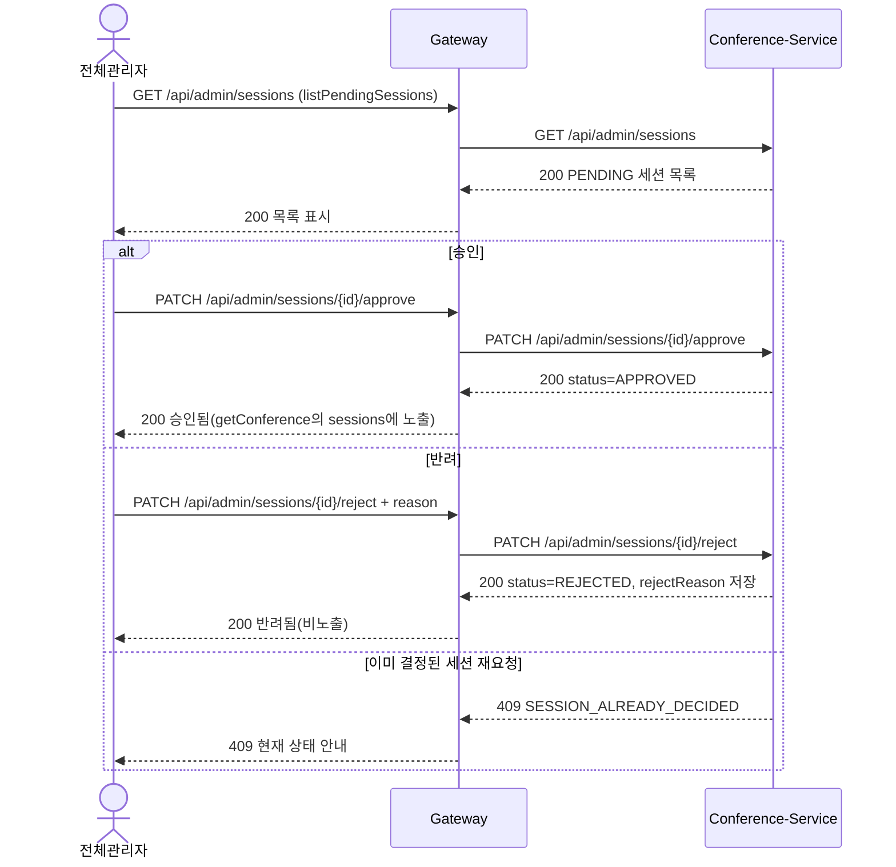
```mermaid
sequenceDiagram
    actor SA as 전체관리자
    participant G as Gateway
    participant CS as Conference-Service
    SA->>G: GET /api/admin/sessions (listPendingSessions)
    G->>CS: GET /api/admin/sessions
    CS-->>G: 200 PENDING 세션 목록
    G-->>SA: 200 목록 표시
    alt 승인
        SA->>G: PATCH /api/admin/sessions/{id}/approve
        G->>CS: PATCH /api/admin/sessions/{id}/approve
        CS-->>G: 200 status=APPROVED
        G-->>SA: 200 승인됨(getConference의 sessions에 노출)
    else 반려
        SA->>G: PATCH /api/admin/sessions/{id}/reject + reason
        G->>CS: PATCH /api/admin/sessions/{id}/reject
        CS-->>G: 200 status=REJECTED, rejectReason 저장
        G-->>SA: 200 반려됨(비노출)
    else 이미 결정된 세션 재요청
        CS-->>G: 409 SESSION_ALREADY_DECIDED
        G-->>SA: 409 현재 상태 안내
    end
```

### **Story 9 — 참가자가 세션을 신청한다 (`#20`)**

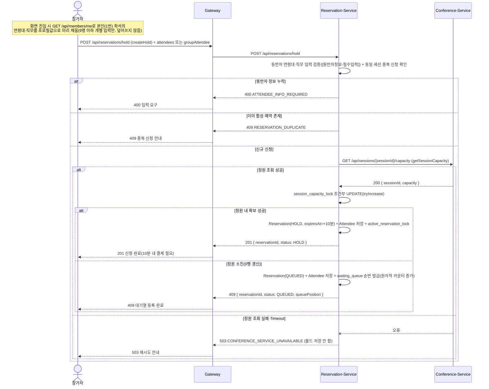
```mermaid
sequenceDiagram
    actor P as 참가자
    participant G as Gateway
    participant RS as Reservation-Service
    participant CS as Conference-Service
    Note over P: 화면 진입 시 GET /api/members/me로 본인(1번) 좌석의<br/>연령대·직무를 프로필값으로 미리 채움(9명 이하 개별 입력만, 덮어쓰지 않음)
    P->>G: POST /api/reservations/hold (createHold) + attendees 또는 groupAttendee
    G->>RS: POST /api/reservations/hold
    RS->>RS: 동반자 연령대·직무 입력 검증([동반자정보-필수입력]) + 동일 세션 중복 신청 확인
    alt 동반자 정보 누락
        RS-->>G: 400 ATTENDEE_INFO_REQUIRED
        G-->>P: 400 입력 요구
    else 이미 활성 예약 존재
        RS-->>G: 409 RESERVATION_DUPLICATE
        G-->>P: 409 중복 신청 안내
    else 신규 신청
        RS->>CS: GET /api/sessions/{sessionId}/capacity (getSessionCapacity)
        alt 정원 조회 성공
            CS-->>RS: 200 { sessionId, capacity }
            RS->>RS: session_capacity_lock 조건부 UPDATE(tryIncrease)
            alt 정원 내 확보 성공
                RS->>RS: Reservation(HOLD, expiresAt=+10분) + Attendee 저장 + active_reservation_lock
                RS-->>G: 201 { reservationId, status: HOLD }
                G-->>P: 201 신청 완료(10분 내 결제 필요)
            else 정원 소진(0행 갱신)
                RS->>RS: Reservation(QUEUED) + Attendee 저장 + waiting_queue 순번 발급(원자적 카운터 증가)
                RS-->>G: 409 { reservationId, status: QUEUED, queuePosition }
                G-->>P: 409 대기열 등록 완료
            end
        else 정원 조회 실패·Timeout
            CS--xRS: 오류
            RS-->>G: 503 CONFERENCE_SERVICE_UNAVAILABLE (홀드 저장 안 함)
            G-->>P: 503 재시도 안내
        end
    end
```

### **Story 10 — 정원 임박 세션에 동시 신청이 몰릴 때 대기열로 처리하고 예상 대기시간을 안내한다 (`#6`, Task 대기열 예상시간 `#269`, 정확도 개선 2026-09-28)**

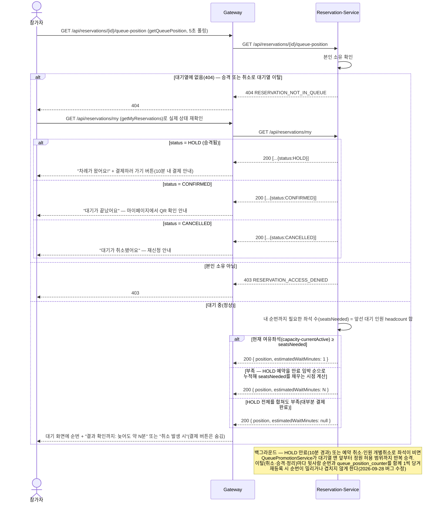
```mermaid
sequenceDiagram
    actor P as 참가자
    participant G as Gateway
    participant RS as Reservation-Service
    P->>G: GET /api/reservations/{id}/queue-position (getQueuePosition, 5초 폴링)
    G->>RS: GET /api/reservations/{id}/queue-position
    RS->>RS: 본인 소유 확인
    alt 대기열에 없음(404) — 승격 또는 취소로 대기열 이탈
        RS-->>G: 404 RESERVATION_NOT_IN_QUEUE
        G-->>P: 404
        P->>G: GET /api/reservations/my (getMyReservations)로 실제 상태 재확인
        G->>RS: GET /api/reservations/my
        alt status = HOLD (승격됨)
            RS-->>G: 200 [...{status:HOLD}]
            G-->>P: "차례가 왔어요!" + 결제하러 가기 버튼(10분 내 결제 안내)
        else status = CONFIRMED
            RS-->>G: 200 [...{status:CONFIRMED}]
            G-->>P: "대기가 끝났어요" — 마이페이지에서 QR 확인 안내
        else status = CANCELLED
            RS-->>G: 200 [...{status:CANCELLED}]
            G-->>P: "대기가 취소됐어요" — 재신청 안내
        end
    else 본인 소유 아님
        RS-->>G: 403 RESERVATION_ACCESS_DENIED
        G-->>P: 403
    else 대기 중(정상)
        RS->>RS: 내 순번까지 필요한 좌석 수(seatsNeeded) = 앞선 대기 인원 headcount 합
        alt 현재 여유좌석(capacity-currentActive) ≥ seatsNeeded
            RS-->>G: 200 { position, estimatedWaitMinutes: 1 }
        else 부족 — HOLD 예약을 만료 임박 순으로 누적해 seatsNeeded를 채우는 시점 계산
            RS-->>G: 200 { position, estimatedWaitMinutes: N }
        else HOLD 전체를 합쳐도 부족(대부분 결제 완료)
            RS-->>G: 200 { position, estimatedWaitMinutes: null }
        end
        G-->>P: 대기 화면에 순번 + "결과 확인까지: 늦어도 약 N분" 또는 "취소 발생 시"(결제 버튼은 숨김)
    end
    Note over RS: 백그라운드 — HOLD 만료(10분 경과) 또는 예약 취소·인원 개별취소로 좌석이 비면<br/>QueuePromotionService가 대기열 맨 앞부터 정원 허용 범위까지 반복 승격.<br/>이탈(취소·승격·정리)마다 뒷사람 순번과 queue_position_counter를 함께 1씩 당겨<br/>재등록 시 순번이 밀리거나 겹치지 않게 한다(2026-09-28 버그 수정)
```

### **Story 11 — 참가자가 PortOne으로 결제를 완료한다 (`#72`)**

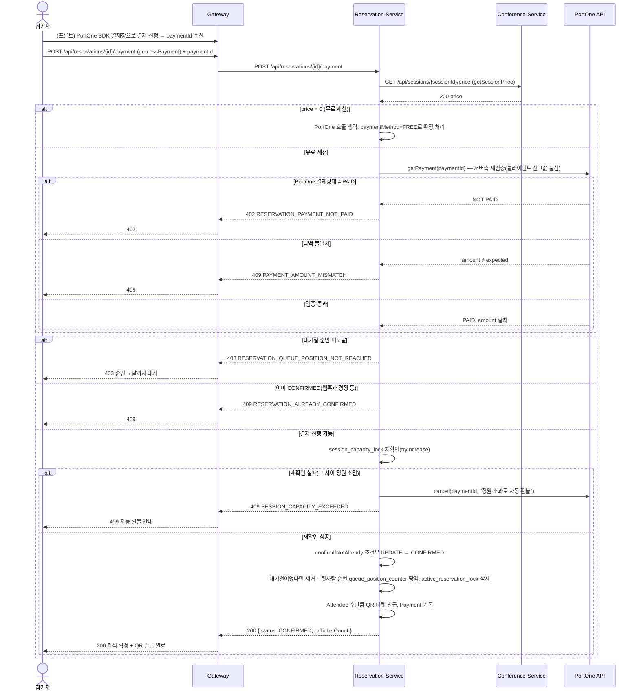
```mermaid
sequenceDiagram
    actor P as 참가자
    participant G as Gateway
    participant RS as Reservation-Service
    participant CS as Conference-Service
    participant PO as PortOne API
    P->>G: (프론트) PortOne SDK 결제창으로 결제 진행 → paymentId 수신
    P->>G: POST /api/reservations/{id}/payment (processPayment) + paymentId
    G->>RS: POST /api/reservations/{id}/payment
    RS->>CS: GET /api/sessions/{sessionId}/price (getSessionPrice)
    CS-->>RS: 200 price
    alt price = 0 (무료 세션)
        RS->>RS: PortOne 호출 생략, paymentMethod=FREE로 확정 처리
    else 유료 세션
        RS->>PO: getPayment(paymentId) — 서버측 재검증(클라이언트 신고값 불신)
        alt PortOne 결제상태 ≠ PAID
            PO-->>RS: NOT PAID
            RS-->>G: 402 RESERVATION_PAYMENT_NOT_PAID
            G-->>P: 402
        else 금액 불일치
            PO-->>RS: amount ≠ expected
            RS-->>G: 409 PAYMENT_AMOUNT_MISMATCH
            G-->>P: 409
        else 검증 통과
            PO-->>RS: PAID, amount 일치
        end
    end
    alt 대기열 순번 미도달
        RS-->>G: 403 RESERVATION_QUEUE_POSITION_NOT_REACHED
        G-->>P: 403 순번 도달까지 대기
    else 이미 CONFIRMED(웹훅과 경쟁 등)
        RS-->>G: 409 RESERVATION_ALREADY_CONFIRMED
        G-->>P: 409
    else 결제 진행 가능
        RS->>RS: session_capacity_lock 재확인(tryIncrease)
        alt 재확인 실패(그 사이 정원 소진)
            RS->>PO: cancel(paymentId, "정원 초과로 자동 환불")
            RS-->>G: 409 SESSION_CAPACITY_EXCEEDED
            G-->>P: 409 자동 환불 안내
        else 재확인 성공
            RS->>RS: confirmIfNotAlready 조건부 UPDATE → CONFIRMED
            RS->>RS: 대기열이었다면 제거 + 뒷사람 순번·queue_position_counter 당김, active_reservation_lock 삭제
            RS->>RS: Attendee 수만큼 QR 티켓 발급, Payment 기록
            RS-->>G: 200 { status: CONFIRMED, qrTicketCount }
            G-->>P: 200 좌석 확정 + QR 발급 완료
        end
    end
```

### **Story 11 부속 — PortOne 웹훅으로 결제를 서버측에서 재확인한다 (Task 11-9)**

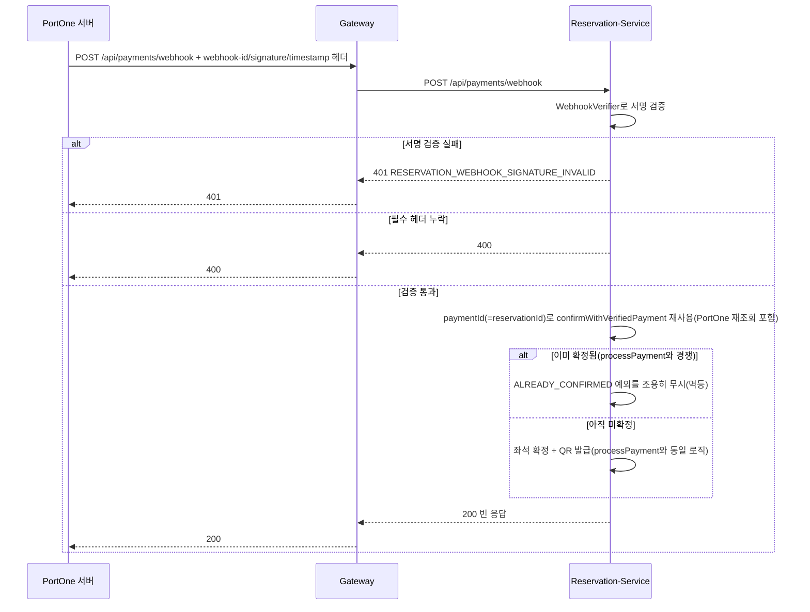
```mermaid
sequenceDiagram
    participant PO as PortOne 서버
    participant G as Gateway
    participant RS as Reservation-Service
    PO->>G: POST /api/payments/webhook + webhook-id/signature/timestamp 헤더
    G->>RS: POST /api/payments/webhook
    RS->>RS: WebhookVerifier로 서명 검증
    alt 서명 검증 실패
        RS-->>G: 401 RESERVATION_WEBHOOK_SIGNATURE_INVALID
        G-->>PO: 401
    else 필수 헤더 누락
        RS-->>G: 400
        G-->>PO: 400
    else 검증 통과
        RS->>RS: paymentId(=reservationId)로 confirmWithVerifiedPayment 재사용(PortOne 재조회 포함)
        alt 이미 확정됨(processPayment와 경쟁)
            RS->>RS: ALREADY_CONFIRMED 예외를 조용히 무시(멱등)
        else 아직 미확정
            RS->>RS: 좌석 확정 + QR 발급(processPayment와 동일 로직)
        end
        RS-->>G: 200 빈 응답
        G-->>PO: 200
    end
```

### **Story 12 — 참가자가 신청을 취소한다 (`#146`)**

```mermaid
sequenceDiagram
    actor P as 참가자
    participant G as Gateway
    participant RS as Reservation-Service
    participant CS as Conference-Service
    participant PO as PortOne API
    P->>G: POST /api/reservations/{id}/cancel (cancelReservation)
    G->>RS: POST /api/reservations/{id}/cancel
    RS->>RS: 예약 조회, 소유자·상태 확인
    alt status = CANCELLED (이미 취소됨)
        RS-->>G: 409 RESERVATION_ALREADY_CANCELLED
        G-->>P: 409 이미 취소된 예약
    else status = CONFIRMED (결제 완료건)
        RS->>CS: GET /api/sessions/{sessionId}/startat (getSessionStartAt)
        CS-->>RS: 200 { sessionStartAt }
        RS->>RS: 남은 일수로 환불율 결정(7일↑100% / 3~6일 50% / 3일↓0%)
        alt refundAmount > 0
            RS->>PO: cancel(reservationId, refundAmount, 사유)
            PO-->>RS: 환불 처리(실패해도 로그만 남기고 취소 흐름은 계속)
        end
        RS->>RS: Payment.recordRefund(누적) + status CONFIRMED→CANCELLED
        RS->>RS: session_capacity_lock 좌석 반환(decrease) + 대기열 즉시 승격 트리거
        RS-->>G: 200 { status: CANCELLED, refundRate, refundAmount }
        G-->>P: 200 취소·환불 완료 안내
    else status = HOLD/QUEUED (결제 전)
        RS->>RS: status → CANCELLED (환불 대상 아님, refundRate/refundAmount=null)
        RS->>RS: HOLD였다면 좌석 반환+대기열 승격 트리거 / QUEUED였다면 대기열 제거+뒷사람 순번·counter 당김
        RS-->>G: 200 { status: CANCELLED }
        G-->>P: 200 신청 취소 완료
    end
```

### **Story 12 부속 — 참가자가 예약 인원 중 일부만 개별 취소한다 (Task 12-5 `#253`)**

```mermaid
sequenceDiagram
    actor P as 참가자
    participant G as Gateway
    participant RS as Reservation-Service
    participant CS as Conference-Service
    participant PO as PortOne API
    P->>G: POST /api/reservations/{id}/tickets/{ticketId}/cancel (cancelTicket)
    G->>RS: POST /api/reservations/{id}/tickets/{ticketId}/cancel
    RS->>RS: 예약 소유자 확인, status=CONFIRMED 확인
    alt CONFIRMED 아님
        RS-->>G: 409 RESERVATION_NOT_CONFIRMED
        G-->>P: 409
    else 대상 티켓이 이미 체크인됨(used=true)
        RS-->>G: 409 QR_TICKET_ALREADY_USED
        G-->>P: 409 체크인된 인원은 개별 취소 불가
    else 남은 유효 티켓이 1장뿐
        RS-->>G: 409 LAST_TICKET_CANNOT_BE_CANCELLED_INDIVIDUALLY
        G-->>P: 409 전체 취소 API 안내
    else 정상 조건
        RS->>CS: GET /api/sessions/{sessionId}/startat, /price
        CS-->>RS: 200 세션 시작시각 + 1인당 가격
        RS->>RS: 1인 기준 환불율 계산(전체 취소와 동일 구간)
        alt refundAmount > 0
            RS->>PO: cancel(reservationId, refundAmount, "인원 개별 취소")
        end
        RS->>RS: Payment.recordRefund(누적, 기존 환불액 유지) + 해당 QrTicket 삭제
        RS->>RS: Reservation.headcount -1, session_capacity_lock -1, 대기열 즉시 승격 트리거
        RS-->>G: 200 { ticketId, refundRate, refundAmount, remainingHeadcount }
        G-->>P: 200 해당 인원만 취소·환불 완료(나머지 인원 CONFIRMED 유지, 마이페이지 QR 목록에서 그 티켓만 제거)
    end
```

### **Story 13 — 참가자가 QR 티켓으로 입장(세션 체크인)한다 (`#151`)**

```mermaid
sequenceDiagram
    actor Staff as 입장담당(주최자 계정)
    participant G as Gateway
    participant RS as Reservation-Service
    participant CS as Conference-Service
    Staff->>G: POST /api/qr-tickets/{code}/scan (scanQrTicket)
    G->>RS: POST /api/qr-tickets/{code}/scan
    RS->>RS: code로 QR 티켓 조회
    alt 존재하지 않는 code
        RS-->>G: 404 QR_TICKET_NOT_FOUND
        G-->>Staff: 404 유효하지 않은 QR
    else 이미 사용된 티켓(used=true)
        RS-->>G: 409 QR_TICKET_ALREADY_USED
        G-->>Staff: 409 이미 입장 처리된 티켓
    else 유효한 티켓(used=false)
        RS->>CS: GET /api/sessions/{sessionId}/startat
        CS-->>RS: 200 sessionStartAt
        alt 현재시각 < 세션 시작시각
            RS-->>G: 403 QR_TICKET_SESSION_NOT_STARTED
            G-->>Staff: 403 조기 입장 불가
        else 세션 시작 이후
            RS->>RS: used=true, usedAt 기록
            RS-->>G: 200 { ticketId, usedAt }
            G-->>Staff: 200 입장 처리 완료
        end
    end
```

### **Story 20 — 참가자가 체크인 완료한 세션에 후기를 남긴다 (`#166`)**

```mermaid
sequenceDiagram
    actor P as 참가자
    participant G as Gateway
    participant RS as Reservation-Service
    P->>G: POST /api/reservations/{id}/reviews (writeReview) + content
    G->>RS: POST /api/reservations/{id}/reviews
    RS->>RS: 예약 소유자 확인
    alt 소유자 아님
        RS-->>G: 403 REVIEW_NOT_OWNER
        G-->>P: 403
    else 예약에 체크인 완료(used=true) 티켓이 하나도 없음
        RS-->>G: 403 REVIEW_NOT_ELIGIBLE
        G-->>P: 403 ([후기-작성자격])
    else 최초 작성
        RS->>RS: Review 신규 저장([후기-1회성])
        RS-->>G: 200 저장 완료
        G-->>P: 200 후기 등록
    else 이미 후기가 있음(같은 reservationId로 재작성)
        RS->>RS: 기존 Review 내용 수정(update-or-insert)
        RS-->>G: 200 저장 완료
        G-->>P: 200 후기 수정됨(작성자 정보는 어디에도 노출 안 됨, [후기-익명])
    end
```

### **Story 21 — 방문자·참가자가 주최자 프로필을 조회한다 (`#167`)**

```mermaid
sequenceDiagram
    actor V as 방문자·참가자
    participant G as Gateway
    participant CS as Conference-Service
    V->>G: GET /api/conferences/{id} (getConference)
    G->>CS: GET /api/conferences/{id}
    CS-->>G: 200 상세 + organizerPastConferenceCount + organizerRepresentativeSummary
    G-->>V: 200 "지난 컨퍼런스 N회 · 대표 후기 요약" 표시
    V->>G: GET /api/organizers/{organizerId}/profile (getOrganizerProfile)
    G->>CS: GET /api/organizers/{organizerId}/profile
    CS->>CS: 해당 주최자의 APPROVED 컨퍼런스만 조회, endAt 기준 과거/진행중 분류([주최자프로필-승인컨퍼런스만])
    CS-->>G: 200 { organizerName, pastConferences[], ongoingConferences[] }(컨퍼런스 0건도 빈 목록으로 200)
    G-->>V: 200 주최자 프로필 표시
```

### **Story 15 — 주최자가 컨퍼런스 참석자 통계를 조회한다 (`#139`)**

```mermaid
sequenceDiagram
    actor O as 주최자
    participant G as Gateway
    participant CS as Conference-Service
    participant RS as Reservation-Service
    participant AI as Gemini API(외부)
    O->>G: GET /api/conferences/{id}/attendee-summary (getAttendeeSummary)
    G->>CS: GET /api/conferences/{id}/attendee-summary
    CS->>CS: OwnerScopeGuard — JWT organizerId ↔ 컨퍼런스 소유자 비교
    alt 소유자 아님
        CS-->>G: 403 CONFERENCE_ACCESS_DENIED
        G-->>O: 403 (소유자원-접근제한)
    else 소유자 확인, checkedInCount 변동 없음(캐시 히트)
        CS->>RS: GET /internal/sessions/attendee-checkin-stats?sessionIds=... (getAttendeeCheckinStats)
        RS-->>CS: 200 집계값(기존과 동일)
        CS-->>G: 200 저장된 요약 그대로 반환(Gemini 미호출)
        G-->>O: 200 통계+요약 표시
    else 소유자 확인, checkedInCount = 0
        CS->>RS: GET /internal/sessions/attendee-checkin-stats?sessionIds=...
        RS-->>CS: 200 { checkedInCount: 0 }
        CS-->>G: 200 { checkedInCount: 0, summaryText: "아직 체크인한 참석자가 없습니다." }(Gemini 미호출)
        G-->>O: 200 안내 문구 표시
    else 소유자 확인, checkedInCount 변동(신규 집계 필요)
        CS->>RS: GET /internal/sessions/attendee-checkin-stats?sessionIds=...
        RS-->>CS: 200 집계값(연령대·직무 분포)
        CS->>RS: GET /internal/reservations/reviews?sessionIds=... (getReviewsBySessionIds)
        RS-->>CS: 200 { reviews: [...] }(실패해도 reviews=[]로 폴백)
        CS->>AI: 집계 수치+후기로 1~2문장 요약 요청(Gemini generateContent)
        alt Gemini 응답 성공
            AI-->>CS: 요약 텍스트
            CS->>CS: conference_attendee_summary upsert
            CS-->>G: 200 통계+새 요약 반환
            G-->>O: 200 통계+요약 표시
        else Gemini 호출 실패·Timeout
            CS-->>G: 200 통계는 정상 + summaryText "요약 정보를 일시적으로 생성하지 못했습니다."
            G-->>O: 200 표시(요약만 대체 문구)
        end
    else Reservation-Service 집계 조회 실패·Timeout
        CS->>RS: GET /internal/sessions/attendee-checkin-stats?sessionIds=...
        RS--xCS: 오류
        alt 기존 캐시 있음
            CS-->>G: 200 기존 캐시 그대로 반환
            G-->>O: 200 이전 통계 표시
        else 캐시 없음
            CS-->>G: 503 RESERVATION_SERVICE_UNAVAILABLE
            G-->>O: 503 재시도 안내
        end
    end
```

### **Story 16 — 주최자가 컨퍼런스 신청·입장 현황을 조회한다 (`#145`)**

```mermaid
sequenceDiagram
    actor O as 주최자
    participant G as Gateway
    participant CS as Conference-Service
    participant RS as Reservation-Service
    O->>G: GET /api/conferences/{id}/operation-status (getOperationStatus)
    G->>CS: GET /api/conferences/{id}/operation-status
    CS->>CS: OwnerScopeGuard 확인
    alt 소유자 아님
        CS-->>G: 403
        G-->>O: 403 (소유자원-접근제한)
    else 소유자 확인
        loop 세션마다 순차 호출(sessionStartAt 오름차순)
            CS->>RS: GET /internal/sessions/{sessionId}/status-summary
            alt 조회 성공
                RS-->>CS: 200 hold/queued/confirmed/cancelled/checkedIn count
            else 조회 실패(즉시 전체 요청 실패)
                RS--xCS: 오류
                CS-->>G: 503 RESERVATION_SERVICE_UNAVAILABLE
                G-->>O: 503 재시도 안내
            end
        end
        CS-->>G: 200 세션별 현황 목록
        G-->>O: 200 표시(다른 주최자 자원은 조회 자체가 불가)
    end
```

### **Story 17 — 주최자가 정산 내역을 조회한다 (`#156`)**

```mermaid
sequenceDiagram
    actor O as 주최자
    participant G as Gateway
    participant CS as Conference-Service
    participant RS as Reservation-Service
    O->>G: GET /api/conferences/{id}/settlement (getSettlement)
    G->>CS: GET /api/conferences/{id}/settlement
    CS->>CS: OwnerScopeGuard 확인
    alt 소유자 아님
        CS-->>G: 403
        G-->>O: 403
    else 소유자 확인
        CS->>RS: GET /internal/sessions/payment-summary?sessionIds=... (getPaymentSummary)
        alt 조회 성공
            RS-->>CS: 200 { totalRevenue, refundedAmount, netRevenue, confirmedCount, cancelledCount }
            CS-->>G: 200 정산 내역([취소건-매출제외] — 취소·환불은 매출에서 제외되어 계산됨)
            G-->>O: 200 매출·수수료 표시
        else 조회 실패
            RS--xCS: 오류
            CS-->>G: 503 RESERVATION_SERVICE_UNAVAILABLE
            G-->>O: 503 재시도 안내
        end
    end
```

### **Story 18 — 전체관리자가 플랫폼 전체 결제·정산 대시보드를 확인한다 (`#150`)**

```mermaid
sequenceDiagram
    actor SA as 전체관리자
    participant G as Gateway
    participant RS as Reservation-Service
    SA->>G: GET /api/admin/settlements?startDate=&endDate= (getSettlementDashboard)
    G->>RS: GET /api/admin/settlements
    RS->>RS: hasRole(ADMIN) 확인
    alt ADMIN
        RS->>RS: CONFIRMED 예약의 결제금액만 기간 필터로 합산([결제완료-기준집계])
        RS-->>G: 200 { totalAmount }
        G-->>SA: 200 집계 표시
    else ADMIN 아님
        RS-->>G: 403
        G-->>SA: 403
    end
    SA->>G: GET /api/admin/settlements/details?startDate=&endDate=&page= (getSettlementDetails)
    G->>RS: GET /api/admin/settlements/details
    RS-->>G: 200 결제 건별 상세(취소 건도 CANCELLED로 함께 노출) + meta.pagination
    G-->>SA: 200 상세 목록 표시
```

### **Story 19 — 전체관리자가 시스템 설정에서 PG 연동 키를 등록한다 (`#128`)**

```mermaid
sequenceDiagram
    actor SA as 전체관리자
    participant G as Gateway
    participant RS as Reservation-Service
    SA->>G: PATCH /api/admin/settings/pg-key (registerPgCredential) + provider/storeId/channelKey/apiSecret/webhookSecret
    G->>RS: PATCH /api/admin/settings/pg-key
    alt ADMIN + 필수값 유효
        RS->>RS: apiSecret·webhookSecret AES-GCM 암호화 후 provider 단위 update-or-create
        RS-->>G: 200 저장 완료(응답의 두 Secret은 뒤 4자리만 노출, [pg키-비공개])
        G-->>SA: 200 등록 완료
    else 필수값 누락
        RS-->>G: 400
        G-->>SA: 400 재입력 요구
    else ADMIN 아님
        RS-->>G: 403
        G-->>SA: 403
    end
    Note over G,RS: 참가자·주최자는 GET /api/payments/pg-config로 Secret 제외한<br/>공개 설정(provider/storeId/channelKey)만 조회해 PortOne SDK 초기화
```

## 실패·복구 흐름

| 시작 조건 | 관련 업무 규칙·계약 | 실패 지점 | 안전한 결과 | 재시도·복구 | 관련 Test·Sprint Demo |
| --- | --- | --- | --- | --- | --- |
| 미승인·존재하지 않는 컨퍼런스 상세 조회 | [승인-전-비공개] / `getConference` | Conference-Service 조회 결과 없음 | `404`(존재 여부 노출 안 함) | 목록으로 복귀 안내 | `ConferenceVisibilityTest` |
| 이미 가입된 이메일로 회원가입 시도 | [이메일-중복-금지] / `signup` | Member-Service Unique 제약 위반 | `409`, 계정 미생성 | 다른 이메일 재입력 또는 로그인 유도 | `MemberSignupLoginTest` |
| 세션 정원 조회(`getSessionCapacity`) Timeout·오류 | [정원-초과-금지] / `createHold` | Reservation→Conference 내부 호출 실패 | `503`, 홀드 생성 안 함(Fail-closed) | 클라이언트 재시도 안내 | `CapacityContractFailureTest` |
| 대기열 순번 미도달 상태에서 결제 진입 시도 | [대기열-순번-제한] / `processPayment` | 결제 진입 게이트 | `403`, 결제 API 호출 자체가 거부됨 | 대기 화면은 결제 버튼 자체를 숨기고 승격 시에만 노출해 클라이언트 단에서도 선제 차단 | `WaitingQueueTest` |
| 대기열 이탈(취소·승격·정리) 후 신규 등록 시 순번 계산 오차 | [대기열-순번-제한] / `createHold`·`cancelReservation` | `queue_position_counter`가 이탈을 반영하지 못해 다음 신규 등록자가 실제보다 큰 순번을 받음 | 이탈 시 카운터를 함께 감소시켜(행 잠금으로 직렬화) 순번이 밀리거나 겹치지 않도록 수정(2026-09-28) | 재현 테스트로 검증 후 배포 | `PaymentQrAcceptanceTest` |
| 주최자가 소유하지 않은 컨퍼런스·세션 자원에 접근 | [소유자원-접근제한] / 전체 `ORGANIZER` API | `OwnerScopeGuard`(Conference) / 서비스 내 소유자 비교(Reservation) | `403` | 본인 소유 자원으로 재요청 | `OwnerScopeGuardTest` |
| 결제 확정 직전 정원이 이미 소진됨 | [정원-초과-금지] / `processPayment` | 검증 후 재확인 단계 조건부 UPDATE 실패 | `409` + PortOne 결제 자동 환불 | 대기열 재등록 또는 다른 세션 안내 | Payment 관련 Acceptance Test |
| PortOne 웹훅 서명 검증 실패 | `paymentWebhook` | `WebhookVerifier.verify` 실패 | `401`, 상태 변경 안 함 | PortOne 측 재전송(멱등 처리로 안전) | Webhook 관련 Test |
| 소셜 로그인 시 이미 같은 이메일의 `MEMBER` 계정이 존재 | [소셜계정-수동연동] / `socialLogin` | 자동 연동 금지 정책 | `409`, 계정 미생성·미연동 | 비밀번호로 로그인 후 `linkSocialAccount`로 수동 연동 | Social Login Acceptance Test |
| 소셜 전용 계정으로 비밀번호 재설정 요청 | [소셜전용계정-재설정불가] / `resetPasswordRequest` | `member.password IS NULL` | `409`, 코드 미발급 | 가입한 소셜 Provider로 로그인 안내 | Password Reset Acceptance Test |
| 진행 중인 컨퍼런스가 있는 주최자의 탈퇴 시도 | [주최자탈퇴-진행중컨퍼런스금지] / `withdraw` | Conference-Service 동기 조회 결과 `hasActiveConference=true` | `409`, 탈퇴 처리 안 함 | 컨퍼런스 종료·이관 후 재시도 | Withdrawal Acceptance Test |
| 체크인된 인원을 개별 취소 시도 / 마지막 1인을 개별 취소 시도 | `cancelTicket` | Reservation-Service 상태 검증 | `409`, 취소 처리 안 함 | 마지막 1인은 전체 취소 API 안내 | Task 12-5 Acceptance Test |
| 세션 시작 전 QR 스캔 시도 | `scanQrTicket` | Reservation-Service `getSessionStartAt` 비교 | `403`, 입장 처리 안 함 | 세션 시작 이후 재스캔 | Task 13-3 Acceptance Test |
| 이미 폐기(rotate)된 Refresh Token이 다시 제출됨 | `refresh` (업무 규칙 아님 — 기술 결정) | Member-Service Refresh Token 조회 | `401`, 해당 회원의 모든 Refresh Token 무효화(재사용 탐지) | 재로그인 요구 | `MemberSignupLoginTest` |
| 전체관리자 권한 없이 승인·반려·회원조회·정산·PG키 API 호출 | 각 Admin 전용 규칙 | 컨트롤러 `@PreAuthorize`(또는 URL 패턴 ADMIN 게이트) | `403`, 상태 변경 안 함(Fail-closed) | 전체관리자 계정으로 재시도 | 각 Admin Acceptance Test |
| Gemini API 호출 Timeout·오류 | [AI요약-실참석기준]/[소개글AI요약-저장독립] / `getAttendeeSummary`·`applyConference` | Conference-Service → Gemini API 호출 실패 | 참석자 통계는 `summaryText`만 고정 실패 문구로 대체(200), 소개글 AI 요약은 빈 값으로 저장은 그대로 성공 | 다음 조회·수정 시 재시도 | Story 15·26 관련 Test |
| 체크인 집계·정산·운영현황 내부 조회(`getAttendeeCheckinStats`/`getPaymentSummary`/`getSessionStatusSummary`) Timeout·오류 | 각 Story 15·16·17 | Conference-Service → Reservation-Service 내부 호출 실패 | 참석자 통계는 캐시 있으면 캐시 반환(200), 없으면 `503`. 운영현황·정산은 캐시가 없어 즉시 `503`(Fail-closed) | 클라이언트 재시도 안내 | 각 Dependency 실패 Test |

시퀀스에서 Payload를 다시 정의하지 않습니다. 호출 순서에는 실제 `operationId`, method/path, 외부 API 이름을 사용합니다.
