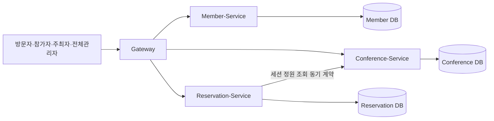

# 아키텍처 정의서

> **작성·동기화 메타정보**
> 
> 
> Notion 원본 URL: https://app.notion.com/p/3cd73873401a80d9be4ee24c173805a4
> 
> Snapshot 기준 시점: `Sprint 1 Review 종료 시점 (2026-09-04)`
> 
> 동기화 시각: `2026-09-04 18:30 KST`
> 
> 직접 편집 금지: Git Snapshot은 직접 편집하지 않고 Notion 원본을 수정한 뒤 다시 동기화합니다.
> 

> 관련 사용자 시나리오: [요구사항 링크]
관련 경계: [서비스경계 절 링크]
> 

## 현재 실행 구조

| Component | 책임 | 소유 데이터 | 관련 Story·계약 | 상태 | 추가·변경 Sprint |
| --- | --- | --- | --- | --- | --- |
| Gateway | 외부 요청 라우팅, 1차 인증 검증, CORS, Trace ID 생성·전파, `/internal/v1/**` 비공개 | 없음 | Story 1 Task 1-1(`#2`) — Gateway 인증·조회 Route 구성 | PLANNED | Sprint 1 |
| Member-Service | 회원가입/로그인, 계정·Role(참가자/주최자/전체관리자) 관리 | member(계정, Role, scope) | Story 2 Task 2-1(`#9`) `POST /api/members/signup`, `POST /api/auth/login` · Story 8 Task 8-1(`#30`) 로그인 흐름 · Story 13 Task 13-1(`#31`) `createOrganizerAccount — POST /api/members/organizers` | PLANNED | Sprint 1 |
| Conference-Service | 컨퍼런스·세션 CRUD, 컨퍼런스 승인/반려 처리(권한검증 포함), 세션 정원·일정 관리 | conference, session(정원·일정·상태) | Story 1 Task 1-2(`#4`) `GET /api/conferences`, `GET /api/conferences/{id}` · Story 9 Task 9-1(`#36`) 컨퍼런스 등록 신청 API · Story 14 Task 14-1(`#38`)·14-2(`#39`) `listPendingConferences`/`approveConference`/`rejectConference` | PLANNED | Sprint 1 (Sprint 2에 Story 10·11로 확장 예정) |
| Reservation-Service | 세션 신청 접수, 정원 검증·홀드, 대기열 순번, 결제 연동, QR 발급, 취소·환불 | reservation, waiting_queue, qr_ticket | Story 3 Task 3-1(`#21`)·3-2(`#23`) 세션 정원 조회 동기 계약 · Story 4 Task 4-1(`#7`) 대기열 등록/순번 조회 | PLANNED | Sprint 1 (Sprint 2에 Story 5 결제·QR, Sprint 3에 Story 6·7 취소환불·QR입장으로 확장 예정) |

## 결정 기록

| 결정 | 근거가 된 사용자 시나리오·위험 | 선택 | 검토 대안 | 결정 Sprint |
| --- | --- | --- | --- | --- |
| 모든 외부 요청은 Gateway를 단일 진입점으로 통과한다 | 전체 시나리오 공통 — 인증·CORS·Trace ID를 서비스마다 중복 구현하면 정책이 서비스별로 어긋날 위험 | Gateway 단일 진입점 + `/internal/**` 비공개 | 서비스별 직접 외부 노출 — 인증 로직 중복, CORS 관리 분산으로 기각 | Sprint 1 |
| 서비스별 DB를 완전히 분리하고 직접 DB 접근·JOIN을 금지한다 | [소유자원-접근제한] 규칙, 서비스 간 강결합 방지 | 서비스당 전용 DB, 논리적 ID(`memberId`·`conferenceId`·`reservationId`) 참조만 허용 | 공유 DB·직접 JOIN — 배포 독립성 상실, 한 서비스 스키마 변경이 전체에 영향을 주는 위험으로 기각 | Sprint 1 |
| Admin 전용 기능은 별도 오케스트레이션 서비스 없이 각 도메인 서비스가 직접 구현한다 | 강사님 피드백("Admin이 필요하면 해당 서비스에서 엔드포인트 직접 제작") — 별도 Admin-Service는 불필요한 홉과 배포
단위만 늘림 |  Member-Service(계정 생성)·Conference-Service(승인/반려)가 각자 권한검증까지 직접 구현 | Admin-Service 오케스트레이션(Sprint 1 초기 결정) — 권한검증 중복·감사 어려움 우려로 도입했으나 실제로는
불필요한 서비스 간 홉만 추가한다고 판단해 철회 | Sprint 1 (재검토) |
| 서비스 간 동기 호출 실패 시 Fail-closed로 처리한다 | [정원-초과-금지], [승인-전-비공개] — 실패 시 임의로 허용 처리하면 정원 초과·미승인 컨퍼런스 노출 위험 | Timeout(3s/5s) 초과·오류 시 503 반환, 상태 변경·좌석 확정 안 함 | Fail-open(임의 성공 처리) — 데이터 정합성이 깨질 위험으로 기각 | Sprint 1 |
| 세션 정원 검증은 신청 시점에 동기 API로 실시간 확인한다 | 시나리오 3·4, [정원-초과-금지] — 동시 신청 상황에서 최종 일관성만으로는 초과 판매 위험 | Reservation-Service → Conference-Service 동기 호출(세션 정원 조회 계약, Task 3-2 `#23`) | 이벤트 기반 비동기 동기화(최종 일관성) — 동시성 상황에서 정원 초과 방지를 보장하기 어려워 기각 | Sprint 1 |

미래 기술을 완성된 구조에 그리지 않습니다.