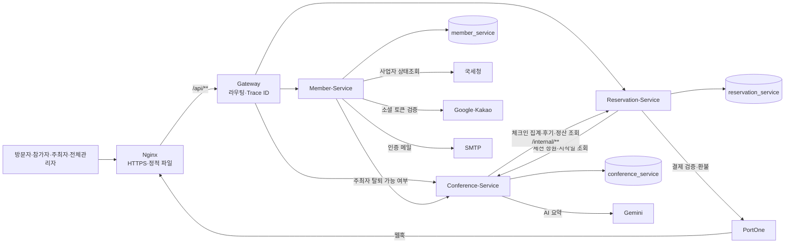

# 아키텍처 정의서

> **작성·동기화 메타정보**
> 
> 
> Notion 원본 URL: https://app.notion.com/p/3cd73873401a80d9be4ee24c173805a4
> 
> Snapshot 기준 시점: `프로젝트 종료 시점 (2026-09-28)`
> 
> 동기화 시각: `2026-09-28 20:19 KST`
> 
> 직접 편집 금지: Git Snapshot은 직접 편집하지 않고 Notion 원본을 수정한 뒤 다시 동기화합니다.
> 

> 관련 사용자 시나리오: [요구사항]
관련 경계: [서비스경계]
> 

## 현재 실행 구조

```mermaid
flowchart LR
    U[방문자·참가자·주최자·전체관리자] --> NG[Nginx<br/>HTTPS·정적 파일]
    NG -->|/api/**| GW[Gateway<br/>라우팅·Trace ID]
    GW --> MS[Member-Service]
    GW --> CS[Conference-Service]
    GW --> RS[Reservation-Service]

    MS -->|주최자 탈퇴 가능 여부| CS
    RS -->|세션 정원·시작일 조회| CS
    CS -->|체크인 집계·후기·정산 조회<br/>/internal/**| RS

    MS --> MDB[(member_service)]
    CS --> CDB[(conference_service)]
    RS --> RDB[(reservation_service)]

    MS -->|사업자 상태조회| NTS[국세청]
    MS -->|소셜 토큰 검증| SO[Google·Kakao]
    MS -->|인증 메일| MAIL[SMTP]
    CS -->|AI 요약| GM[Gemini]
    RS -->|결제 검증·환불| PO[PortOne]
    PO -->|웹훅| NG
```

| Component | 책임 | 소유 데이터 | 관련 Story·계약 | 상태 | 추가·변경 Sprint |
| --- | --- | --- | --- | --- | --- |
| Gateway | 외부 요청 라우팅(/api/**만), 요청마다 Trace ID(X-Trace-Id) 생성 | 없음 | Story 1 Task 1-1(`#2`) — Gateway 인증·조회 Route 구성 · Task 라우팅 확장(`#47`) · `/api/admin/settlements`, `/api/admin/settings/**` 라우팅 | IMPLEMENTED | Sprint 1 |
| Member-Service | 회원가입/로그인(이메일 인증·소셜 로그인), 주최자 자체 가입(사업자등록번호 진위확인), 비밀번호 재설정, 회원 탈퇴, 전체관리자 회원 조회, 계정·Role(참가자/주최자/전체관리자) 관리 | member(계정, Role, organizationName, businessNo) | Story 2 Task 2-1(`#9`) `POST /api/members/signup`, `POST /api/auth/login` · Story 4 Task 4-1(`#30`) 로그인 흐름 · Story 3(`#26`) `signupOrganizer — POST /api/members/organizers/signup`(舊 관리자가 발급하던 `POST /api/members/organizers` 계약은 폐기) | IMPLEMENTED | Sprint 1 (Sprint 2에 Story 3 주최자 자체 회원가입으로 확장) |
| Conference-Service | 컨퍼런스·세션 CRUD, 컨퍼런스·세션 승인/반려 처리(권한검증 포함), 세션 정원·일정 관리, 컨퍼런스 참석자 통계(AI 요약) 생성, 소개글 AI 요약 생성, 공지·FAQ 관리 | conference, session(정원·일정·상태), conference_attendee_summary, conference_notice, conference_faq, conference_tag | Story 1 Task 1-2(`#4`) `GET /api/conferences`, `GET /api/conferences/{id}` · Story 5 Task 5-1(`#36`) 컨퍼런스 등록 신청 API · Story 6(`#27`) `listPendingConferences`/`approveConference`/`rejectConference` · Story 8(`#68`) `listPendingSessions`/`approveSession`/`rejectSession` · Story 7 세션 정원·신청기간 등록·수정(주최자가 승인된 컨퍼런스에 세션을 만들고 정원·기간을 설정) · Story 15 getAttendeeSummary/getAttendeeCheckinStats · Task 컨퍼런스 소개글 AI 요약(`#267`) | IMPLEMENTED | Sprint 1 (Sprint 2에 Story 6·7·8 컨퍼런스·세션 승인 및 세션 정원·일정 설정으로 확장), Sprint 3에 Story 15 참석자 통계로 확장 |
| Reservation-Service | 세션 신청 접수(동반자 연령대·직무 수집 포함), 정원 검증·홀드, 대기열 순번·예상 대기시간, 결제 연동, QR 발급, 취소·환불, 후기 작성, PG 연동 키 등록, 참석자 통계 원본 데이터 제공, 주최자 정산 내역 조회 | reservation, waiting_queue, session_capacity_lock, qr_ticket, attendee, pg_credential, payment, review | Story 9 Task 9-1(`#21`)·9-2(`#23`) 세션 정원 조회 동기 계약 · Story 10 Task 10-1(`#7`) 대기열 등록/순번 조회 · Story 15 getAttendeeCheckinStats · Story 17 getPaymentSummary · Story 11 processPayment/handlePaymentWebhook/getPgConfig(PortOne 실연동) · Story 12 cancelReservation(PortOne 실제 환불) · Story 18 getSettlementDashboard · Story 19 registerPgCredential · Story 20 후기 작성 | IMPLEMENTED | Sprint 1 (Sprint 2에 Story 11 결제·QR, Sprint 3에 Story 12·13 취소환불·QR입장, Story 15 참석자 통계 원본 제공, Story 17 정산 조회로 확장) |

## 결정 기록

| 결정 | 근거가 된 사용자 시나리오·위험 | 선택 | 검토 대안 | 결정 Sprint |
| --- | --- | --- | --- | --- |
| 모든 외부 요청은 Gateway를 단일 진입점으로 통과한다 | 전체 시나리오 공통 — 인증·CORS·Trace ID를 서비스마다 중복 구현하면 정책이 서비스별로 어긋날 위험 | Gateway 단일 진입점 + `/internal/**` 비공개 | 서비스별 직접 외부 노출 — 인증 로직 중복, CORS 관리 분산으로 기각 | Sprint 1 |
| JWT는 Gateway가 아니라 각 서비스가 직접 검증한다 |  Gateway를 무조건 신뢰하면, Gateway를 우회하거나 헤더가 위조됐을 때 다른 사용자로 행세할 수 있음 | 서비스별 JwtAuthenticationFilter가 공유 비밀키(HS256)로 매 요청 검증 | Gateway 일괄 검증 | Sprint 1 |
| CORS 대신 같은 출처(same-origin)로 서빙한다 | 프론트와 API를 Nginx 한 곳에서 서빙 | /api/ → Gateway 프록시 | 서비스별 CORS 설정 | Sprint 1 |
| 서비스별 DB를 완전히 분리하고 직접 DB 접근·JOIN을 금지한다 | [소유자원-접근제한] 규칙, 서비스 간 강결합 방지 | 서비스당 전용 DB, 논리적 ID(`memberId`·`conferenceId`·`reservationId`) 참조만 허용 | 공유 DB·직접 JOIN — 배포 독립성 상실, 한 서비스 스키마 변경이 전체에 영향을 주는 위험으로 기각 | Sprint 1 |
| Admin 전용 기능은 별도 오케스트레이션 서비스 없이 각 도메인 서비스가 직접 구현한다 | 강사님 피드백(“Admin이 필요하면 해당 서비스에서 엔드포인트 직접 제작”) — 별도 Admin-Service는 불필요한 홉과 배포 단위만 늘림 | Member-Service(회원 조회)·Conference-Service(승인/반려)가 각자 권한검증까지 직접 구현 | Admin-Service 오케스트레이션(Sprint 1 초기 결정) — 권한검증 중복·감사 어려움 우려로 도입했으나 실제로는 불필요한 서비스 간 홉만 추가한다고 판단해 철회 | Sprint 1 (재검토) |
| 서비스 간 동기 호출 실패 시 핵심 흐름은 Fail-closed로 처리한다 | [정원-초과-금지], [승인-전-비공개] — 실패 시 임의로 허용하면 정원 초과·미승인 노출 위험 | Timeout·오류 시 상태 변경·좌석 확정 안 함(신청 거부) | Fail-open(임의 성공 처리) — 데이터 정합성이 깨질 위험으로 기각 | Sprint 1 |
| 참고용 정보(예상 대기시간) 조회 실패는 Fail-open으로 처리한다 | 대기열 예상시간은 신청·결제를 막을 사유가 아님 | Conference-Service 장애 시 기본값 5분 사용 | 실패 시 대기열 조회 자체를 거부 — 참고 정보 때문에 핵심 흐름이 막혀 기각 | Sprint 3 |
| 세션 정원 검증은 신청 시점에 동기 API로 실시간 확인한다 | 시나리오 9·10, [정원-초과-금지] — 동시 신청 상황에서 최종 일관성만으로는 초과 판매 위험 | Reservation-Service → Conference-Service 동기 호출(세션 정원 조회 계약, Story 9 Task 9-2 `#23`) | 이벤트 기반 비동기 동기화(최종 일관성) — 동시성 상황에서 정원 초과 방지를 보장하기 어려워 기각 | Sprint 1 |
| 주최자 계정은 전체관리자가 발급하지 않고, 이메일 인증과 사업자등록번호 진위확인을 통과하면 자체 가입으로 생성한다 | Story 3, [사업자번호-인증필수]·[주최자가입-중복금지]·[이메일인증-필수] 규칙 — 관리자 승인 대기 병목 없이 온보딩해야 함 | 자체 가입 엔드포인트에서 이메일 인증과 사업자등록번호 진위확인을 통과하면 즉시 Role=ORGANIZER 부여 | 전체관리자가 계정을 생성해 발급하는 방식(Sprint 1 초기 설계) — 관리자 병목·온보딩 지연 우려로 기각, Sprint 2에서 폐기 | Sprint 2 |
| 사업자등록번호 진위 확인은 국세청 사업자등록정보 진위확인 API를 연동해 수행한다 | Story 3, [사업자번호-인증필수] — 형식 검증만으로는 실제 사업자 여부를 보증하지 못해 가입 어뷰징 가능(Sprint 1 리뷰 피드백) | 국세청 진위확인 API 연동(서비스 키는 환경변수로 주입) | 형식 검증만 하는 Mock 유지 — 실제 사업자 여부를 보증하지 못해 기각 | Sprint 2 |
| 결제 대기 중인 홀드(HOLD)에 유효시간(TTL)을 두고 자동 만료시켜 대기열에 승계한다 | Sprint 1 리뷰 피드백 — 홀드가 무기한 유지되면 대기열 인원에게 좌석이 넘어가지 않는 문제 | 홀드 TTL 10분, 만료 시 대기열 1번에게 승계. 만료 처리는 스케줄러(1분 주기)로 동작 | 무기한 홀드 유지(Sprint 1 현행) — 좌석 회전이 막혀 폐기 | Sprint 2 |
| 컨퍼런스·세션 승인·반려는 전체관리자가 API로 처리하고 반려 사유를 저장한다 | Story 6·8, Sprint 1 리뷰 피드백 — SQL 수동 승인은 재현성·감사 가능성이 없음 | ADMIN 전용 승인·반려 API(`approveConference`/`rejectConference`, `approveSession`/`rejectSession`) | SQL 수동 승인 유지(Sprint 1 현행) — 판단 기준·이력이 남지 않아 폐기 | Sprint 2 |
| 세션 정원·신청기간은 주최자가 승인된 컨퍼런스 범위 안에서 직접 설정하고, 세션 공개는 전체관리자 승인 후 이루어진다 | Story 7·8, [세션정원-유효성]·[승인-전-비공개] 규칙 — 정원 설정은 온보딩을 막지 않되 승인 전 세션이 참가자에게 노출되면 안 됨 | Conference-Service가 소유자원 검증과 `정원>0`·`시작일<종료일` 유효성을 서버에서 강제하고, 세션은 승인 전까지 비공개 | 세션 정원 설정 자체에 사전 승인 추가 — 등록 단계 병목이 생겨 기각 | Sprint 2 |

미래 기술을 완성된 구조에 그리지 않습니다.
